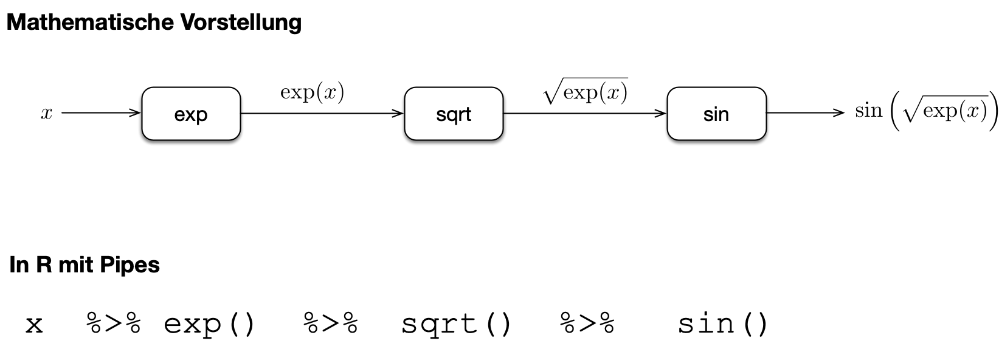
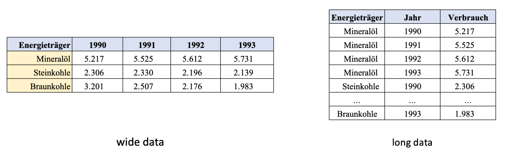
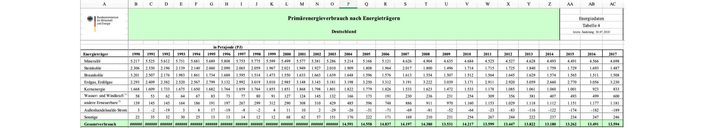
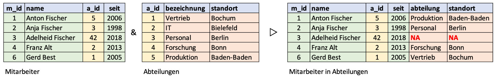
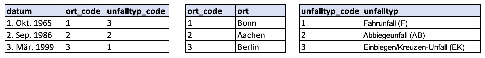

```{r}
#| include: false
library(gt)
library(hms)
library(knitr)
library(readxl)
library(tidyverse)

show_dataframe <- function(d, options, ...) {
  gt(d) |>
    opt_interactive(
      use_text_wrapping = FALSE,
      page_size_default = 9,
      use_compact_mode = TRUE,
      use_pagination = (nrow(d) > 9)
    ) |>
    knitr::knit_print(options, ...)
}

registerS3method("knit_print", "data.frame", show_dataframe)
```

# Ziel bei der Aufbereitung von Daten

## Tidy data

> “Happy families are all alike; every unhappy family is unhappy in its own way.” — Leo Tolstoy

> “Tidy datasets are all alike, but every messy dataset is messy in its own way.” — Hadley Wickham

Tidy data (aufgeräumte Daten)

- In jeder Spalte steht eine Variable
- In jeder Zeile steht eine Beobachtung
- In jeder Zelle steht ein Wert
- Wir haben alle Variablen, die wir benötigen

[]{.up30}

→ Nicht immer so eindeutig, wie es hier klingt

## Pragmatischer Ansatz

[]{.down120}

- Daten sind dann aufgeräumt, wenn das, was man vorhat, einfach umzusetzen ist
- Zum Beispiel plotten

# Der Pipe-Operator `|>`

## Verkettete Funktion $f(x) = \sin\left(\sqrt{ e^x } \right)$

**Mit geschachtelten Funktionen**

```{r}
sin(sqrt(exp(1.5)))
```

→ Zuerst wird $e^{1.5}$ berechnet, dann die Wurzel gezogen und danach der Sinus ermittelt

**Mit Pipe-Operator**

```{r}
1.5 |> exp() |> sqrt() |> sin()
```

→ Operator `|>` fügt linke Seite als erstes Argument der Funktion rechts ein

## Verkettete Funktion $f(x) = \sin\left(\sqrt{ e^x } \right)$



# Variablen auswählen oder umbenennen mit `select()` und `rename()`

## Wann braucht man das?

[]{.down120}

- In der Datenquelle stehen mehr Informationen als benötigt
- Die Namen der Merkmale sind in der Datei nicht gut gewählt

## Beispieldatensatz: Geschwindigkeitsmessung

```{r}
d_uni <- read_excel("daten/unistrasse-2017-2.xlsx", sheet = "raw(T)", range = "B2:H20712")
```

```{r}
#| echo: false
d_uni
```

## Variablen auswählen mit `select()`

```{r}
d_uni |> select(Datum, Geschwindigkeit, "Länge (cm)", Fahrzeug)
```

- Variablen angeben, die beibehalten werden sollen
- Anführungszeichen bei Namen mit Leerzeichen

## Variablen entfernen mit `select()`

```{r}
d_uni |> select(-Fahrtrichtung, -Abstand, -"Länge (Radar)")
```

- Variablen mit vorangestelltem `-` werden entfernt
- Anführungszeichen bei Namen mit Leerzeichen

## Variablen umbenennen mit `select()`

```{r}
d_uni |> select(Datum, v = Geschwindigkeit, L = "Länge (cm)", Fahrzeug)
```

- Auswählen und umbenennen mit `neuer_name = alter_name` 
- Andere Variablen einfach beibehalten

## Variablen nach Muster auswählen

```{r}
d <- tibble(A_X = 1:2, B_X = 3:4, C_X = 5:6, X_A = 7:8, X_B = 9:10, X_C = 11:12, ABC = 13:14)
```

```{r}
#| echo: false
d
```

:::: {.columns}
::: {.column width=50%}

```{r}
d |> select(starts_with("X_"))
```

```{r}
d |> select(ends_with("_X"))
```

:::
::: {.column width=50%}

```{r}
d |> select(-starts_with("X_"))
```

```{r}
d |> select(-ends_with("_X"))
```

:::
::::

- Mit `starts_with()` und `ends_with()` Muster für Namen festlegen
- Funktioniert auch wieder mit `-`

## Variablen umbenennen mit `rename()`

```{r}
d_uni |> rename(v = Geschwindigkeit, laenge = "Länge (Radar)")
```

- Variable umbenennen mit `neuer_name = alter_name`
- Alle anderen Variablen werden beibehalten

# Beobachtungen auswählen mit `filter()` und `slice()`

## Wann braucht man das?

[]{.down120}

- Wenn einzelne Werte aussortiert werden sollen
- Wenn man sich nur für bestimmte Beobachtungen interessiert

## Beispieldatensatz

```{r}
d <- d_uni |> select(Datum, Fahrzeug, Abstand, Geschwindigkeit)
```

```{r}
#| echo: false
d
```

## Filter: Nur LKW

```{r}
d |> filter(Fahrzeug == "LKW")
```

- Bedingung als logischer Ausdruck mit Name der Variablen

## Filter: Nur LKW schneller als 60km/h

```{r}
d |> filter(Fahrzeug == "LKW" & Geschwindigkeit > 60)
```

- Bedingung als logischer Ausdruck mit Name der Variablen
- Logisches und: `&` 

## Filter: Nur LKW oder Fahrzeuge schneller 80km/h

```{r}
d |> filter(Fahrzeug == "LKW" | Geschwindigkeit > 80)
```

- Bedingung als logischer Ausdruck mit Name der Variablen
- Logisches oder: `|` 

## Filter: Fahrzeugtyp nicht erkannt

```{r}
d |> filter(is.na(Fahrzeug))
```

## Filter: Zeilen mit `NA` entfernen

```{r}
d |> filter(!is.na(Fahrzeug))
```

## Filter: Kriterium in Vektor

```{r}
d |> filter(Fahrzeug %in% c("Zweirad", "LKW"))
```

- Werte für Merkmal aus Vektor

## Auswahl nach Zeilennummer mit `slice()`

```{r}
d |> slice(c(10, 30, 700))
```

- Beobachtungen nach Position auswählen

## Auswahl am Anfang oder am Ende

::: {.columns}
::: {.column}
```{r}
d |> slice_head(n = 10)
```
:::
::: {.column}
```{r}
d |> slice_tail(n = 10)
```
:::
:::

- Erste oder letzte `n` (Anzahl) Beobachtungen auswählen
- Dabei: `head` wie Kopf und `tail` wie Schwanz oder Ende

## Auswahl kleinste oder größte Beobachtungen

::: {.columns}
::: {.column}
```{r}
d |> slice_min(Geschwindigkeit, n = 10)
```
:::
::: {.column}
```{r}
d |> slice_max(Geschwindigkeit, n = 10)
```
:::
:::

- Die kleinsten und größten `n` (Anzahl) Beobachtungen auswählen
- `min` wie Minimum und `max` wie Maximum


# Beobachtungen sortieren mit `arrange()`

## Wann braucht man das?

[]{.down120}

- Wenn man sich für die größten oder kleinsten Werte interessiert
- Um die Reihenfolge beim Plotten zu ändern, so dass bestimmte Objekte über anderen liegen

## Beobachtungen mit kleinster Geschwindigkeit

```{r}
d |> arrange(Geschwindigkeit)
```

- Sortiert aufsteigend nach dem angegebenen Merkmal

## Beobachtungen mit größter Geschwindigkeit

```{r}
d |> arrange(desc(Geschwindigkeit))
```

- Mit `desc()` absteigend sortieren

## Nach mehreren Kriterien sortieren (1/2)

```{r}
d |> arrange(Fahrzeug, Geschwindigkeit)
```

- Zuerst nach Fahrzeugen sortieren
- Innerhalb einer Fahrzeuggruppe nach Geschwindigkeit angeordnet

## Nach mehreren Kriterien sortieren (2/2)

```{r}
d |> arrange(Geschwindigkeit, Fahrzeug)
```

- Zuerst nach der Geschwindigkeit sortieren
- Innerhalb einer Geschwindigkeiten nach Fahrzeugen angeordnet

# Variablen hinzufügen oder verändern mit `mutate()`

## Wann braucht man das?

[]{.down120}

- Wenn aus den vorliegenden Werten neue Werte berechnet werden sollen
- Wenn bestehende Werte verändert werden sollen (typischerweise: Datum)

## Geschwindigkeit runden

```{r}
d |> mutate(V10 = signif(Geschwindigkeit, digits = 1))
```

- `neue_variable = Ausdruck(alte_variablen)`
- Mit `signif()` auf eine signifikante Stellte gerundet

## Datum konvertieren 1/2

```{r}
d |> show()
```

- Nach dem Einlesen ist das Merkmal Datum eine Zeichenkette

## Datum konvertieren 2/2

```{r}
d |> mutate(Datum = dmy_hms(Datum, tz = "Europe/Berlin")) |> show()
```

- In date-time konvertieren mit `dmy_hms()`, ggf. Zeitzone angeben

## Zusätzlich mit Uhrzeit

```{r}
d |>
  mutate(
    Datum = dmy_hms(Datum, tz = "Europe/Berlin"),
    Uhrzeit = as_hms(Datum)
  )
```

- Mit `as_hms()` die Uhrzeit heraussuchen (`library(hms)`)

## Datum runden

```{r}
d |> 
  mutate(
    Datum = dmy_hms(Datum, tz = "Europe/Berlin"),
    D15 = floor_date(Datum, "15 minutes")
  )
```

- `floor_date(x, unit)` rundet ab auf angegebene Einheit

## Alles in einem Rutsch {.smaller}

```{r}
d_unistrasse <- read_excel("daten/unistrasse-2017-2.xlsx",sheet="raw(T)",range="B2:H20712") |>
  select(Datum, Fahrzeug = Fahrzeug, L = `Länge (cm)`, v = Geschwindigkeit) |>
  filter(!is.na(Fahrzeug)) |>
  mutate(
    Datum = dmy_hms(Datum, tz = "Europe/Berlin"),
    D15 = floor_date(Datum, "15 minutes"),
    Uhrzeit = as_hms(Datum)
  )
d_unistrasse
```

- Mehrere Operationen nacheinander ausgeführt
- Lesbarkeit: Jede Operation in eine eigene Zeile

## Damit: Plot Uhrzeit und Geschwindigkeit 

```{r}
ggplot(data = d_unistrasse) +
  geom_hex(mapping = aes(x = Uhrzeit, y = v)) 
```

- Histogramm der Geschwindigkeitsverteilung über Uhrzeit

## Bedingte Anweisung mit `if_else()`

```{r}
d |> mutate(Raser = if_else(Geschwindigkeit >= 70, "Ja", "Nein"))
```

- Erster Parameter: Bedingung als logischer Ausdruck
- Zweiter Parameter: Wert falls Bedingung erfüllt
- Dritter Parameter: Wert falls Bedingung nicht erfüllt

# Zusammenfassen mit `summarize()` und `group_by()`

## Wann braucht man das?

[]{.down120}

- Um Ausprägungen zu zählen
- Wenn Kenngrößen von Verteilungen benötigt werden

## Nur `summarize()`

```{r}
d_unistrasse |> 
  summarise(Anzahl = n(), Mittelwert = mean(v), Standardabweichung = sd(v))
```

- Wie `mutate()`, aber Funktionen werden auf alle Werte angewendet
- Beobachtungen zählen mit `n()`
- Funktionen `mean()` und `sd()` wie gehabt

→ In dieser Form nicht besonders nützlich

## Kombination `group_by()` und `summarize()`

```{r}
d_unistrasse |> 
  group_by(Fahrzeug) |> 
  summarise(Anzahl = n(), Mittelwert = mean(v), Standardabweichung = sd(v))
```

- Daten mit `group_by()` nach Kriterium gruppieren
- Danach wird mit `summarize()` zusammenfassen
  * Gruppierungsmerkmal(e) bleiben erhalten
  * Funktionen in `summarize()` werden auf Gruppen angewendet

→ In Kombination **sehr** flexibel einsetzbar

## Beispiel: 15-Minuten Geschwindigkeit

```{r}
d <- d_unistrasse |>
  group_by(D15) |>
  summarise(VMit = mean(v))
ggplot(data = d, mapping = aes(x = D15, y = VMit)) + geom_line() + geom_point() 
```

## Effekt von `group_by()`

```{r}
d_unistrasse |> str()
```

## Effekt von `group_by()` - Attribute zur Gruppierung

```{r}
d_unistrasse |> group_by(Fahrzeug) |> str()
```

# Daten umordnen mit `pivot_longer()` und `pivot_wider()`

## Wann braucht man das?

[]{.down120}

- `pivot_longer()`: Wenn Namen von Variablen Werte sein sollten
- `pivot_wider()`: Wenn Werte Namen von Variablen sein sollten

→ Manchmal sind auch beide Varianten notwendig

## Breite und lange Tabellen



- Man spricht von breiten (*wide*) und langen (*long*) Tabellenformaten
- Aufgeräumte Daten *(tidy data)* sind meistens lang

→ Was man wirklich braucht hängt von der konkreten Situation ab

## Beispiel: Energieträger (Quelle: BMWi)



- Unpraktisch zum Plotten und Weiterverarbeiten
- Wir würden gerne
  - Die Spalte Energieträger beibehalten
  - Aus den Variablennamen 1990-2017 das Merkmal Jahr machen
  - Die Werte in einem Merkmal Verbrauch speichern

## Einlesen der Daten (Quelle: BMWi)

```{r}
d_et_wide <- read_excel("daten/energiedaten-gesamt-xls.xlsx", sheet="4", range="A8:AC17")
```

```{r}
#| echo: false
d_et_wide
```

## Transformation mit `pivot_longer()` 1/2

```{r}
d_et_wide |> pivot_longer(cols = "1990":"2017", names_to = "Jahr", values_to = "Verbrauch")
```

- Variablen `1990` bis `2017` umordnen
- `names_to = Name`: Variable für alte Variablennamen 
- `values_to = Name`: Variable für Werte

## Transformation mit `pivot_longer()` 2/2

```{r}
d_et_wide |> pivot_longer(cols = !Energieträger, names_to = "Jahr", values_to = "Verbrauch")
```

- Alle Variablen außer `Energieträger` umordnen
- `names_to = Name`: Variable für alte Variablennamen 
- `values_to = Name`: Variable für Werte

## Beispiel vollständig

```{r}
d_et_long <- 
  read_excel("daten/energiedaten-gesamt-xls.xlsx", sheet="4", range="A8:AC17") |>
  pivot_longer(!Energieträger, names_to = "Jahr", values_to = "Verbrauch") |>
  mutate(Jahr = as.numeric(Jahr))
ggplot(data = d_et_long) +
  geom_line(mapping = aes(x = Jahr, y = Verbrauch, color = Energieträger))
```

- In einem Rutsch einlesen und weiterverarbeiten
- Jahr in Zahl konvertieren mit `mutate()`

## Werte verteilen mit `pivot_wider()`

```{r}
d_et_long |> pivot_wider(names_from = Energieträger, values_from = Verbrauch)
```

- `names_from = Name`: Variable mit neuen Variablennamen
- `values_from = Name`: Variable mit Werten, die verteilt werden sollen
- Damit transponierte der ursprünglichen Tabelle

# Dataframes verknüpfen mit `left_join()`

## Wann braucht man das?

[]{.down120}

- Wenn zwei Dataframes kombiniert werden sollen
- Wenn in einer Spalte Kürzel stehen, die in einem anderen Dataframe hinterlegt sind

## Dataframes über einen Schlüssel miteinander verknüpfen

[]{.down60}



[]{.down40}

- Tabellen sind über gemeinsames Merkmal (gelb) miteinander verknüpft
- Neue Tabelle mit Werten zu Verknüpfungsmerkmal
- Schlüssel in zweiter Tabelle nicht vorhanden: NAs einsetzen
- Schlüssel müssen in zweiter Tabelle eindeutig sein!

## Dataframes

```{r}
d_mitarbeitende <- read_excel("daten/mitarbeitende-beispiel.xlsx", range = "B2:E7")
```

```{r}
#| echo: false
d_mitarbeitende
```

```{r}
d_abteilungen <- read_excel("daten/mitarbeitende-beispiel.xlsx", range = "G2:I7")
```

```{r}
#| echo: false
d_abteilungen
```

## Verknüpfung der Dataframes mit `left_join()`

```{r}
#| message: false
d_mitarbeitende |> left_join(d_abteilungen)
```

- Dataframes müssen ein Merkmal gemeinsam haben
- Gegebenenfalls Merkmal mit `rename()` umbenennen (wie `select()`)
- Left in `left_join()`: Alle Zeilen aus linker Tabelle werden übernommen
- Andere Varianten (`inner_join()` etc.) für Spezialfälle
- Ausgabe von `left_join` unterdrücken mit `#| message: false`

## Anwendung: Kodierte Werte 1/3



- In den Rohdaten sind Codes eingetragen und nicht Werte 
- Warum macht man das?
  - Arbeit sparen wenn Werte von Hand eingetragen werden
  - Speicherplatz sparen bei umfangreichen Tabellen
- Für statistische Auswertung: Dataframe mit Werten

## Anwendung: Kodierte Werte 2/3

[]{.down50}

```{r}
d_ud <- read_excel("daten/beispiel-kodierung.xlsx", range="B2:D5")
```

```{r}
#| echo: false
d_ud
```

[]{.down50}

::: {.columns}
::: {.column}
```{r}
d_ud_k1 <- read_excel("daten/beispiel-kodierung.xlsx", range="F2:G5")
```
```{r}
#| echo: false
d_ud_k1
```
:::
::: {.column}
```{r}
d_ud_k2 <- read_excel("daten/beispiel-kodierung.xlsx", range="I2:J5")
```
```{r}
#| echo: false
d_ud_k2
```
:::
:::

## Anwendung: Kodierte Werte 3/3

```{r}
#| message: false
d_ud |>
  left_join(d_ud_k1) |>
  left_join(d_ud_k2) |>
  select(-ends_with("_code"))
```

- Unfalldaten mit beiden Kodierungstabellen verknüpfen
- Variable mit den Codes löschen

# Dataframes aneinanderhängen `bind_rows()`/`bind_cols()`

## Dataframes aneinander hängen {.smaller}

```{r}
d1 <- tibble(X = c("A", "B"), Y = c(1, 2))
d2 <- tibble(Y = c(3, 1), Z = c(98, 99))
```

::::: columns
::: {.column}
```{r}
d1
```
:::
::: {.column}
```{r}
d2
```
:::
:::::

::::: columns
::: {.column}
### Nebeneinander

```{r}
d1 |> bind_cols(d2)
```
- Wichtig: Anzahl der Beobachtungen gleich
- Doppelte Merkmale mit `...`
:::
::: {.column}
### Untereinander

```{r}
d1 |> bind_rows(d2)
```
- Fehlende Merkmale mit `NA`
:::
:::::

# Verschiedenes

## Werte durch NAs ersetzen 1/4

{fig-align=center}

Niederschlagsdaten vom Deutschen Wetterdienst

- Wert -999 kennzeichnet eine fehlende Beobachtung
- In R sollte das ein `NA` sein

## Werte durch NAs ersetzen 2/4

```{r}
d_ns <- read_delim(
  "daten/produkt_nieder_monat_18910101_20171231_00555.txt",
  delim = ";", , trim_ws=TRUE, locale = locale(decimal_mark = ".", grouping_mark = ",")
)
```

```{r}
#| echo: false
d_ns
```

- Wert -999 in fast allen Variablen

## Werte durch NAs ersetzen (eine Variable) 3/4

```{r}
d_ns |> 
  mutate(
    MO_NSH = na_if(MO_NSH, -999)
  ) 
```

- Mit `na_if(Y, x)` alle Werte `x` in Variable `Y` durch `NA` ersetzen

## Werte durch NAs ersetzen (mehrere Variablen) 4/4

```{r}
d_ns |> 
  mutate(
    across(c(MO_NSH, MO_RR, MO_SH_S, MX_RS), ~na_if(.x, -999))
  )
```

- Mit `across` die Formel `~na_if(., -999)` auf mehrere Variablen anwenden

## Werte auftrennen 1/2

```{r}
d_z <- tibble(X = c("10, A, 4.3", "11, X, 1.9", "2, R, 3.3"))
```

```{r}
#| echo: false
d_z
```

- Drei Werte in jeder Beobachtung

## Werte auftrennen 2/2

```{r}
d_z |> separate(X, c("Wert", "Name", "Laenge"))
```

- Funktion `separate(...)` verteilt Werte auf Variablen
- Erster Parameter: Variable mit Ausgangswerten
- Zweiter Parameter: Vektor mit neuen Namen

## Gruppiertes `mutate()` 1/3

```{r}
d_et_long
```

- Gesucht: Neue Variable mit dem anteiligen Energieverbrauch
- Wert ist 100 x Energieverbrauch / Gesamtverbrauch im Jahr

## Gruppiertes `mutate()` 2/3

```{r}
d <- d_et_long |>
  group_by(Jahr) |>
  mutate(Anteil = 100 * Verbrauch / sum(Verbrauch))
```

```{r}
#| echo: false
d <- d |> ungroup()
d
```

- Daten nach Jahren gruppieren
- Mit `sum()` die Summe in einer Gruppe berechnen

## Gruppiertes `mutate()` 3/3

```{r}
d |>
  filter(Jahr == 2000)
```

- Kontrolle: Die Anteile müssen sich zu 100% addieren
- 38 + 14 + 11 + 21 + 13 + 1 + 2 = 100, passt also! 

## Gruppiertes `slice()` 1/2

```{r}
d_unistrasse
```

- Gesucht ist das schnellste Fahrzeug aus jeder Gruppe

## Gruppiertes `slice()` 2/2

```{r}
d_unistrasse |> select(-D15) |>
  group_by(Fahrzeug) |>
  slice_max(v, n = 1) |> ungroup()
```

- Nach Fahrzeugtyp gruppieren
- Mit `slice_max(v, n = 1)` schnellstes Fahrzeug heraussuchen
- Alternativ mit `summarize()`

## Werte ersetzen mit `recode()` 1/2 {.smaller}

```{r}
d_et_wide
```

- Bezeichnungen teilweise zu lang
- Verweise auf Erläuterungen für statistische Auswertung nicht hilfreich

## Werte ersetzen mit `recode()` 2/3 {.smaller}

```{r}
d_et_wide |>
  mutate(
    Energieträger = replace_values(
      Energieträger,
      "Erdgas, Erdölgas" ~ "Gas",
      "Wasser- und Windkraft 1) 3)" ~ "Wasser/Wind",
      "andere Erneuerbare 2)" ~ "andere Erneuerbare"
    )
  )
```

- Ersetzen mit `"Alter Wert" ~ "Neuer Wert"`

## Werte ersetzen mit `recode()` 3/3 {.smaller}

```{r}
alt <- c("Erdgas, Erdölgas", "Wasser- und Windkraft 1) 3)", "andere Erneuerbare 2)")
neu <- c("Gas",              "Wasser/Wind",                 "andere Erneuerbare")

d_et_wide |>
  mutate(
    Energieträger = replace_values(
      Energieträger, from = alt, to = neu
    )
  )
```

- Alternative mit Vektoren
