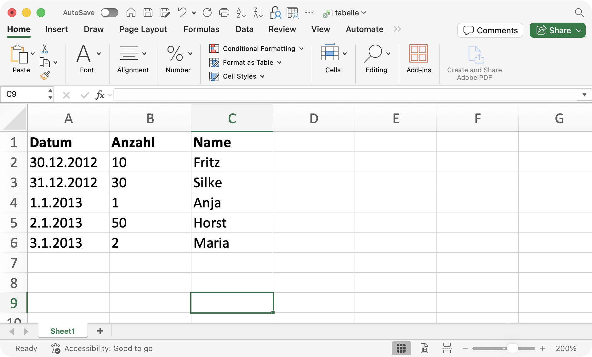
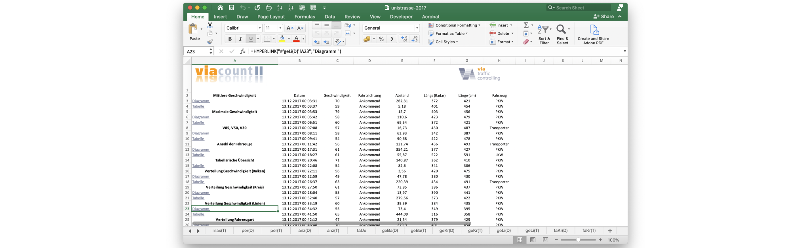
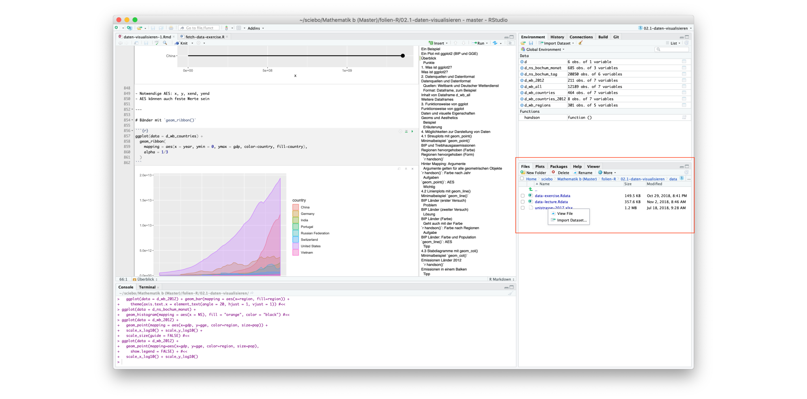
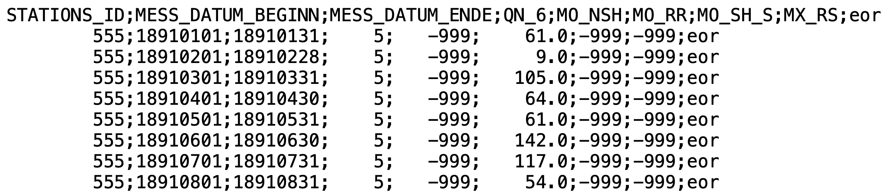

```{r}
#| include: false
library(gt)
library(knitr)
library(tidyverse)

show_dataframe <- function(d, options, ...) {
  gt(d) |>
    opt_interactive(
      use_text_wrapping = FALSE,
      page_size_default = 9,
      use_compact_mode = TRUE,
      use_pagination = (nrow(d) > 9)
    ) |>
    knitr::knit_print(options, ...)
}
registerS3method("knit_print", "data.frame", show_dataframe)
```

# Tidyverse

## Tidyverse

[]{.down40}


[]{.down40}

- Sammlung von Bibliotheken für Data-Science in R
- Durchgängige Designphilosophie und Datenstrukturen
- Viele Dinge leichter und eleganter zu erledigen als in 'reinem' R
- Ursprünglich von Hadley Wickham, heute viele Entwickler
- Einführung vom Autor auf [Youtube](https://youtu.be/MjHQo-t2v_c) (englisch)

# Excel-Dateien lesen

## Funktion `read_excel(...)`

### Paket laden

```{r}
library(readxl)
```

### Tabelle einlesen

```{.r}
d <- read_excel(Dateiname, Argumente...)
```

### Die wichtigsten Argumente

Argument        | Bedeutung                                   | Optional
----------------|---------------------------------------------|---------
skip = 5        | Anzahl zeilen, die überlesen werden sollten | Ja
range = "B2:G5" | Einzulesender Bereich (ersetzt `skip`)      | Ja
sheet = "Name"  | Tabellenblatt, das gelesen werden soll      | Ja

## Beispiel 1: Einfache Tabelle

[]{.down50}

::: {.columns}
::: {.column width="42%"}
[]{.up10}

:::
::: {.column width="58%"}
[]{.up20}
```{r}
read_excel("daten/tabelle.xlsx")
```
:::
:::

[]{.down50}

- `read_excel(...)` liest [Excel-Datei](daten/tabelle.xlsx) und gibt Dataframe zurück
- Im einfachsten Fall nur Datei angeben, Inhalt von erstem Tabellenblatt
- Datentypen der Spalten werden korrekt erkannt

## Leider nicht immer so einfach

[]{.down50}



[]{.down50}

Wo liegt das Problem?

- Es soll bestimmtes Tabellenblatt gelesen werden
- Bereiche links und oben sollen ignoriert werden

→ Importassistent!

## Importassistent 1/3



## Importassistent 2/3


## Importassistent 3/3

```{r}
read_excel("daten/unistrasse-2017.xlsx",sheet="raw(T)",range="B2:H20712")
```

- Einstellung in Excel unvollständig, daher Datum nicht richtig gelesen

# CSV-Dateien einlesen

## Aufbau und Inhalt von CSV-Dateien

{.framed}

- CSV: Comma Separated Values, weit verbreitet, nicht standardisiert
- Häufig Kopfzeile(n) mit Beschreibung des Inhalts
- Inhalt in der Regel mit
  - Datenfeldern getrennt z.B. durch Komma, Semikolon, Leerzeichen...
  - Datum in verschiedensten Formaten
  - Zahlen mit oder ohne Dezimaltrenner (Punkt oder Komma)
  - Spezielle Kennzeichnung von fehlenden Werten

## Amerikanische Konvention

Datei [beispiel-1.csv](daten/beispiel-1.csv){download=""}

:::: {.columns}
::: {.column width="45%"}
```{raw}

```
:::
::: {.column width="55%"}
[]{.up10}

- Einträge durch "`,`" getrennt
- Dezimaltrenner ist "`.`"
- Datum mit Jahr/Monat/Tag
:::
::::

Einlesen mit `read_csv(...)`

```{r}
#| eval: false
read_csv("daten/beispiel-1.csv")
```

:::: {.columns}
::: {.column width="45%"}
```{r}
#| echo: false
#| message: false
read_csv("daten/beispiel-1.csv")
```
:::
::: {.column width="55%"}
- Datentypen richtig erkannt
:::
:::

## Deutsche Konvention

Datei [beispiel-2.csv](daten/beispiel-2.csv){download=""}

:::: {.columns}
::: {.column width="45%"}
```{raw}

```
:::
::: {.column width="55%"}
[]{.up10}

- Einträge durch "`;`" getrennt
- Dezimaltrenner "`,`", Tausender "`.`" 
- Datum mit Tag/Monat/Jahr
:::
::::

Einlesen mit `read_csv2(...)`

```{r}
#| eval: false
read_csv2("daten/beispiel-2.csv")
```

:::: {.columns}
::: {.column width="45%"}
```{r}
#| echo: false
#| message: false
read_csv2("daten/beispiel-2.csv")
```
:::
::: {.column width="55%"}
- Datum nicht richtig erkannt
:::
:::

## Gemischte Konvention

Datei [beispiel-3.csv](daten/beispiel-3.csv){download=""}

:::: {.columns}
::: {.column width="45%"}
```{raw}

```
:::
::: {.column width="55%"}
[]{.up10}

- Einträge durch "`;`" getrennt
- Dezimaltrenner "`.`", Tausender "`,`" 
- Datum mit Tag/Monat/Jahr
:::
::::

Einlesen mit `read_delim(...)`

```{r}
#| eval: false
read_delim("daten/beispiel-3.csv", delim = ";", trim_ws = TRUE, locale = locale(decimal_mark = ".", grouping_mark = ","))
```

:::: {.columns}
::: {.column width="45%"}
```{r}
#| echo: false
#| message: false
read_delim("daten/beispiel-3.csv", delim = ";", trim_ws = TRUE, locale = locale(decimal_mark = ".", grouping_mark = ","))
```
:::
::: {.column width="55%"}
- `delim`: *Delimiter* ist das Trennzeichen
- `locale`: Länderspezifische Dinge
- `trim_ws`: Entfernt Leerzeichen
- Datum nicht richtig erkannt
:::
:::

## Kodierung

Datei [beispiel-4.csv](daten/beispiel-4.csv){download=""}

:::: {.columns}
::: {.column width="45%"}
```{raw}

```
:::
::: {.column width="55%"}
[]{.up10}

- Datei ISO-8859-1 [kodiert](https://de.wikipedia.org/wiki/Zeichenkodierung)
- Grundeinstellung in R ist UTF-8
- Sonst deutsche Konvention
:::
::::

Einlesen mit `read_csv2(...)`

```{r}
#| eval: false
read_csv2("daten/beispiel-4.csv", locale = locale(encoding = "iso-8859-1"))
```

:::: {.columns}
::: {.column width="45%"}
```{r}
#| echo: false
#| message: false
read_csv2("daten/beispiel-4.csv", locale = locale(encoding = "iso-8859-1"))
```
:::
::: {.column width="55%"}
- Kodierung beim Einlesen angeben
:::
:::

## Beispiel: Niederschlagsdaten Bochum

```{r}
#| message: false
read_delim(
  "daten/produkt_nieder_monat_18910101_20171231_00555.txt",
  delim = ";", trim_ws=TRUE,
  locale = locale(decimal_mark = ".", grouping_mark = ",")
)
```

## CSV-Dateien Zusammenfassung

[]{.down40}

### Funktionen

```{r}
#| eval: false
read_csv(Dateiname, Argumente...)   # Amerikanische Konvention
read_csv2(Dateiname, Argumente...)  # Deutsche Konvention
read_delim(Dateiname, locale=locale(decimal_mark=".", grouping_mark=","), Argumente...)
```

[]{.down80}

### Die wichtigsten Argumente

Argument                 | Bedeutung                                   | Optional
-------------------------|---------------------------------------------|---------
`skip = 5`               | Anzahl Zeilen, die überlesen werden sollten | Ja
`trim_ws = TRUE`         | Leerzeichen entfernen (für `read_delim`)    | Ja
`show_col_types = FALSE` | Ausgabe unterdrücken                        | Ja

: {tbl-colwidths="[35, 55, 10]"}

# Rohdaten

## Hände weg von den Rohdaten!


::: {.columns}
::: {.column}
### Rohdaten nicht verändern

- Schwer nachvollziehbar
- Nicht rückgängig zu machen
- Schlimmstenfalls Datenverlust
:::
::: {.column}
### Stattdessen

- Rohdaten unverändert einlesen
- In R aufbereiten
- R-Code dokumentiert Änderungen
:::
:::

→ Relevant für Benotung!

## Beim Einlesen von Daten gilt immer

[]{.down120}

- In der Regel funktioniert es nicht auf Anhieb
- Eingelesene Daten sehr sorgfältig anschauen!
- Überblick verschaffen mit `summary(d)` und/oder `str(d)`

