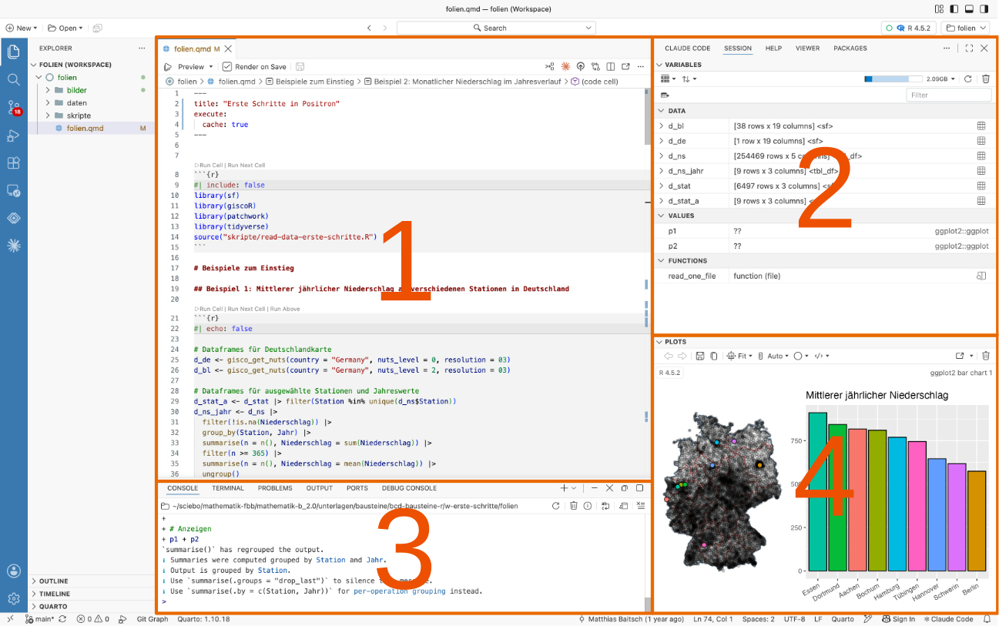
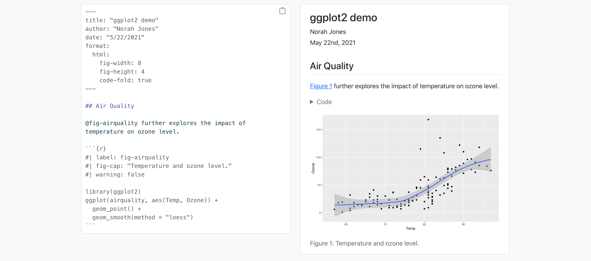
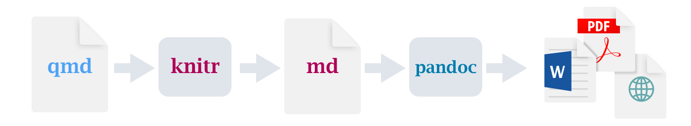
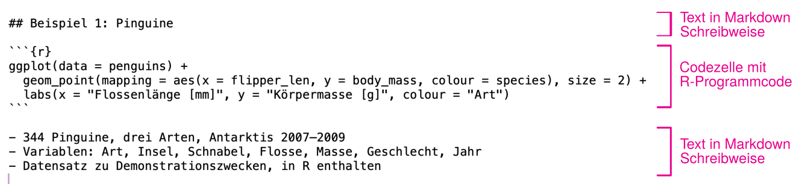
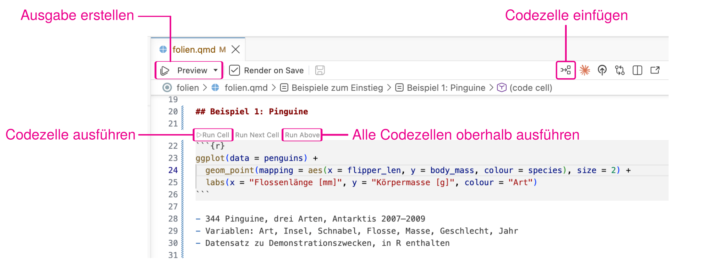

```{r}
#| cache: false
#| include: false
library(sf)
library(giscoR)
library(patchwork)
library(tidyverse)
source("skripte/read-data-erste-schritte.R")
```

# Beispiele zum Einstieg

## Beispiel 1: Pinguine

```{r}
ggplot(data = penguins) +
  geom_point(mapping = aes(x = flipper_len, y = body_mass, colour = species), size = 2) +
  labs(x = "Flossenlänge [mm]", y = "Körpermasse [g]", colour = "Art")
```

- 344 Pinguine, drei Arten, Antarktis 2007–2009
- Variablen: Art, Insel, Schnabel, Flosse, Masse, Geschlecht, Jahr
- Datensatz zu Demonstrationszwecken, in R enthalten

## Beispiel 2: Monatlicher Niederschlag im Jahresverlauf

```{r}
#| echo: false

ggplot(data = d_ns_monat) +
  geom_boxplot(mapping = aes(x = Monat, y = Niederschlag)) +
  coord_fixed(0.025) +
  labs(title = "Monatliche Niederschläge (alle Stationen)")
```

- Daten aus den Dateien im Ordner `daten`
- Einlesen mithilfe von `skripte/read-data-erste-schritte.R`
- Das werden Sie lernen

## Beispiel 3: Monatlicher Niederschlag im Jahresverlauf

```{r}
#| echo: false

ggplot(data = d_ns_monat) +
  geom_boxplot(mapping = aes(x = Monat, y = Niederschlag, fill = Station)) +
  coord_fixed(0.025) +
  labs(title = "Monatliche Niederschläge (nach Stationen)")
```

## Beispiel 4: Mittlerer jährlicher Niederschlag an verschiedenen Stationen in Deutschland

```{r}
#| echo: false

# Dataframes für Deutschlandkarte
d_de <- gisco_get_nuts(country = "Germany", nuts_level = 0, resolution = 03)
d_bl <- gisco_get_nuts(country = "Germany", nuts_level = 2, resolution = 03)

# Dataframes für ausgewählte Stationen und Jahreswerte
d_stat_a <- d_stat |> filter(Station %in% unique(d_ns$Station))
d_ns_jahr <- d_ns |>
  filter(!is.na(Niederschlag)) |>
  group_by(Station, Jahr) |>
  summarise(n = n(), Niederschlag = sum(Niederschlag)) |>
  filter(n >= 365) |>
  summarise(n = n(), Niederschlag = mean(Niederschlag)) |>
  ungroup()

# Plot auf Landkarte
p1 <- ggplot() +
  geom_sf(data = d_bl, fill = NA, color = "lightcoral", linewidth = 0.5) +
  geom_sf(data = d_de, fill = NA, color = "slategray", linewidth = 0.75) +
  geom_sf(data = d_stat, alpha = 0.2) +
  geom_sf(
    data = d_stat_a,
    mapping = aes(fill = Station),
    shape = 21,
    color = "black",
    size = 2.5,
    show.legend = FALSE
  ) +
  theme_void()

# Plot der Niederschläge
p2 <- ggplot(data = d_ns_jahr) +
  geom_col(
    mapping = aes(
      x = reorder(Station, desc(Niederschlag)),
      y = Niederschlag,
      fill = Station
    ),
    color = "black",
    show.legend = FALSE
  ) +
  labs(title = "Mittlerer jährlicher Niederschlag", x = NULL, y = NULL) +
  theme(axis.text.x = element_text(angle = 30, vjust = 1, hjust = 1))

# Anzeigen
p1 + p2
```

## Von den Daten zu den Folien

[Tageswerte der Niederschläge](daten/produkt_nieder_tag_18900101_20231231_04625.txt) an den verschiedenen Stationen vom Deutschen Wetterdienst

[]{.down20}

### Wie entstehen daraus die Folien?

1. Daten aus Datei einlesen
1. Jahres- und Monatswerte ermitteln
1. Grafiken erstellen
1. Daraus zusammen mit Text das HTML-Dokument erzeugen

### Und wie funktioniert das?

1. Wir schreiben Text und R-Anweisungen in Quarto-Markdown-Datei
1. [Quarto](https://quarto.org) erstellt daraus das HTML-Dokument

## Was wir uns hierzu anschauen werden

[]{.down100}

1. Statistische Grundlagen
1. Daten visualisieren mit ggplot2
1. Daten einlesen und aufbereiten
1. Basics der Programmiersprache R
1. Arbeiten mit der Programmierumgebung Positron

# Was ist R und was ist Positron?

## R und Positron


### Programmiersprache R

- Programmiersprache für Statistik und Datenvisualisierung
- Frei verfügbar, erste Version 1993 veröffentlicht
- Keine Angst: Das wird keine Informatikvorlesung

### Arbeitsumgebung Positron

- Grafische Oberfläche zur Datenanalyse mit R (und Python)
- Von Posit, den Entwicklern von RStudio, basiert auf VS Code
- Wir verwenden Quarto-Markdown für die Erstellung von Dokumenten

## Die Oberfläche von Positron



1. Editor: Hier geben Sie ihren Text und Programmcode ein
1. Variablen (u.A.): Aktuell definierte Variablen
1. Konsole (u.A.): Hier können Sie direkt R-Befehle eingeben
1. Plots (u.A.): Ausgabe der Grafiken

# Quarto-Markdown in Positron

## Reproduzierbare Statistik

[]{.down20}

### Traditionelle Arbeitsweise (zum Beispiel mit Word)

- Statistische Untersuchungen mit speziellem Programm
- Ergebnisse und Grafiken von Hand in Dokument übernehmen
- Vorteile: Einfach, gewohnte Arbeitsweise
- Nachteile: Fehler in Berechnung - Zurück auf Start! Weg von den Daten zum Dokument nicht reproduzierbar

### Arbeiten mit Quarto

- Quarto-Markdown-Dokument fasst Text und Berechnungen zusammen
- Daraus wird PDF/HTML/Word/PPT erzeugt (ähnlich wie mit LaTeX)
- Vorteile: Änderungen einfach, Methoden nachvollziehbar, reproduzierbar
- Nachteile: Ungewohnte Arbeitsweise, Lernkurve

## Möglichkeiten mit Quarto

[]{.down100}

- Kurze Berichte erstellen
- Präsentationen (Sie schauen gerade eine an) vorbereiten
- [Ganze Bücher schreiben](https://r4ds.hadley.nz)
- [Interaktive Webapplikationen entwickeln (mit Shiny)](https://shiny.rstudio.com/gallery/)
- [Hier eine Sammlung von Beispielen](https://quarto.org/docs/gallery/)
- [Video zur Einführung (englisch)](https://youtu.be/_f3latmOhew?si=bGnCJk9dwSYG6cLK)

## Ein einfaches Beispiel



- links: Eingabe in Quarto Markdown
- rechts: Ausgabe in html

- [Quelle](https://quarto.org/docs/computations/r.html)

## Quarto konvertiert Quarto-Markdown

[]{.down140}



## Quarto-Markdown-Dokumente



### Ein Quarto-Markdown-Dokument

- ist eine reine Textdatei mit der Erweiterung .qmd
- beginnt mit ein paar Grundeinstellungen (oben nicht dargestellt)
- danach kommt
  - Text in spezieller Markdown-Schreibweise
  - Blöcke mit R-Code, die so genannten 'Chunks'

## Quarto-Markdown in Positron



- Chunks lassen sich einzeln oder alle zusammen ausführen
- Ergebnisse erscheinen in der Konsole, Grafiken im Plots-Bereich
