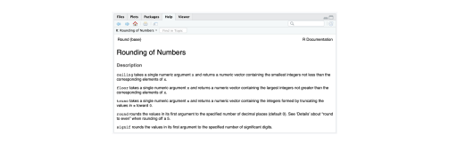
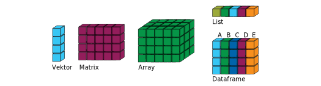
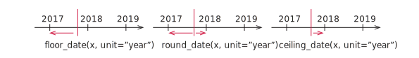

```{r}
#| include: false
library(gt)
library(hms)
library(knitr)
library(tidyverse)

show_dataframe <- function(d, options, ...) {
  gt(d) |>
    opt_interactive(
      use_text_wrapping = FALSE,
      page_size_default = 9,
      use_compact_mode = TRUE,
      use_pagination = (nrow(d) > 9)
    ) |>
    knitr::knit_print(options, ...)
}
registerS3method("knit_print", "data.frame", show_dataframe)
```

# Operatoren und grundlegende Funktionen

## Arithmetische Operatoren

[]{.down80}

| Operator | Beschreibung   | Beispiel          |
|:--------:|:---------------|:------------------|
|   `+`    | Addieren       | 4 + 5 = 9         |
|   `-`    | Subtrahieren   | 5 - 4 = 1         |
|   `*`    | Multiplizieren | 4 \* 4 = 16       |
|   `/`    | Dividieren     | 1 / 2 = 0.5       |
|   `^`    | Potenzieren    | 2\^0.5 = 1.414214 |
|   `%%`   | Modulo bilden  | 7 %% 5 = 2        |

- Modulo bilden = Bestimmung des Rests einer ganzzahligen Division

## Beispiel

```{r}
1e5 / 33
pi %% 3
1 / 3 + 1 / 2
6^8
```

- Werte werden ohne spezielle print-Anweisung ausgegeben
- Standardmäßig werden Fließkommaoperationen durchgeführt
- Lassen Sie Platz um die Operatoren (außer um \^)

## Variablen 1/2

```{r}
x <- 32
y <- 7 / 8
x * y
```

- Daten und Berechnungsergebnisse werden in Variablen gespeichert
- Der Zuweisungsoperator in R ist `<-` (Tastenkombination alt + -)
- Variablen im *Environment* gelistet (RStudio oben rechts)
- Namen von Variablen müssen mit einem Buchstaben beginnen

## Variablen 2/2

```{r}
X <- pi
x <- 2
a.b <- 100
x * X * a.b
```

- `pi` ist eine vorbelegte Variable mit Näherung für $\pi$
- Groß- und Kleinschreibung wird berücksichtigt
- Der Punkt ist ein ganz normaler Buchstabe und kein Operator

## Weitere Zuweisungsoperatoren

Zuweisung nach rechts

```{r}
33 -> x
x
```

- Die Schreibweise `<-` funktioniert auch so `->` rum

[]{.down40}

Es geht aber auch traditionell

```{r}
x = 200
x
```

- Wenn Ihnen das lieber ist, verwenden Sie `=`
- Bei einer Schreibweise bleiben

## Primitive Datentypen

[]{.down20}

| Datentyp  | Literale             | Art           |
|-----------|----------------------|---------------|
| logical   | `TRUE`, `FALSE`      | Wahrheitswert |
| integer   | `5L`, `125L`         | Ganze Zahl    |
| double    | `1`, `1.75`, `1e10`  | 'Reelle' Zahl |
| character | `"Hello World!"`     | Zeichenkette  |

: {tbl-colwidths="[30, 35, 35]"}

[]{.down40}

- Datentypen werden nicht explizit angegeben (anders als in Java)
- Voreinstellung für Zahlen ist `double`

## Vordefinierte Konstanten

[]{.down20}

| Konstante        | Bedeutung                                           |
|------------------|-----------------------------------------------------|
| `Inf` und `-Inf` | Unendlich und minus Unendlich                       |
| `NaN`            | Rechenoperation ergibt keine reelle Zahl, z.B. $\sqrt{-1}$ |
| `NULL`           | Ein leeres Objekt                                   |
| `NA`             | Unbekannter Datenwert (Not Available)               |

: {tbl-colwidths="[30, 70]"}

## Mathematische Funktion

[]{.down20}

| Funktionen                        | Beschreibung                                    |
|-----------------------------------|-------------------------------------------------|
| `sin(x)`, `cos(x)`, `tan(x)`, ... | Trigonometrische Funktionen                     |
| `abs(x)`, `sqrt(x)`               | Absolutwert, Wurzel                             |
| `log(x)`, `exp(x)`                | Natürlicher Logarithmus und Exponentialfunktion |
| `log2(x)`, `log10(x)`             | Logarithmus mit anderen Basen                   |

: {tbl-colwidths="[30,70]"}

Beispiele

```{r}
exp(1)
log2(4096)
```

## Funktionen zur Typumwandlung

[]{.down20}

| Funktion          | Bedeutung                        |
|-------------------|----------------------------------|
| `as.numeric(x)`   | Konvertiert in eine Zahl         |
| `as.character(x)` | Konvertiert in eine Zeichenkette |
| `as.logical(x)`   | In Wahrheitswert konvertieren    |

: {tbl-colwidths="[30,70]"}

- Funktion `as.logical`
  - Zahlenwert 0 entspricht `FALSE`,
  - Andere Zahlenwerte entsprechen `TRUE`

## Beispiele

```{r}
3 * as.numeric("1.81")
as.character(pi)
as.logical(0)
as.logical(0.1)
```

## Vergleichsoperatoren und Verknüpfungen

[]{.down40}

|    Operator        |           Bedeutung           |
|--------------------|-------------------------------|
| `a < b`, `a <= b`  |  Kleiner und kleiner gleich   |
| `a > b`, `a >= b`  |   Größer und größer gleich    |
| `a == b`, `a != b` | Exakt gleich und nicht gleich |
|   `near(a, b)`     |          Fast gleich          |
|    `is.na(x)`      |    Test of `x` gleich `NA`    |

: {tbl-colwidths="[40,60]"}

[]{.down40}

| Verknüpfung   |   Bedeutung    |
|-----------|----------------|
|  `a & b`  | Logisches und  |
|  `a | b`  | Logisches oder |
|    `!a`   |    Negation    |

: {tbl-colwidths="[40,60]"}

## Beispiele

::: {.columns}
::: {.column}
```{r}
NA == 10
NA == NA
is.na(NA)
is.na(10)
2 * 10 == 20
```
:::
::: {.column}
```{r}
pi < 3.14
as.character(3 * 9 + 1) == 28
TRUE | FALSE
TRUE & FALSE
!(TRUE & FALSE)
```
:::
:::

## Rechengenauigkeit

```{r}
sqrt(2) ^ 2 == 2
1 / 49 * 49 == 1
```

→ Rundungsfehler, Zahlen mit rund 15 Nachkommastellen

```{r}
near(sqrt(2)^2, 2)
near(1 / 49 * 49, 1)
```

→ Vergleichen mit `near()`

## Weitere nützliche Funktionen 1/2

[]{.down80}

| Funktion                | Beschreibung                                |
|-------------------------|---------------------------------------------|
| `paste0(...)`           | Verbindet mehrere Werte zu Character        |
| `paste(..., sep = " ")` | Wie paste0 aber mit Trennzeichen            |
| `signif(x, digits = 6)` | Rundet auf Anzahl von signifikanten Stellen |
| `round(x, digits = 0)`  | Runden auf Anzahl von Stellen               |

: {tbl-colwidths="[40,60]"}


## Weitere nützliche Funktionen 2/2

```{r}
paste(1, 2, 3, 4, 5, 6)
paste(1, 2, 3, 4, 5, 6, sep = ", ")
paste0(1, 2, 3, 4, 5, 6)
signif(9283649, 4)
paste0("pi = ", round(pi, digits = 4))
```

## Optionale Parameter von Funktionen

```{.r}
round(x, digits = 0)
```

Funktion `round` besitzt Parameter `x` (die Zahl die gerundet werden soll) und einen optionalen
Parameter `digits` (Anzahl der Stellen). Wird `digits` nicht angegeben, dann verwendet R den Wert 0.
Beim Funktionsaufruf kann man den Namen des Parameters weglassen (kürzer) oder angeben (meist besser
zu verstehen).

```{r}
round(pi)
round(pi, 1)
round(pi, digits = 2)
```

## Funktionen mit vielen Parametern

```{.r}
`paste(..., sep = " ")
```

Der Funktion `paste` können beliebig viele Parameter übergeben werden. Der Name des optionalen
Parameters muss angegeben werden.

```{r}
paste(1, 2, 3)
paste(1, 2, 3, 4, 5, 6, "$")
paste(1, 2, 3, 4, 5, 6, sep = "$")
```

## Hilfe zu R-Funktionen



- In RStudio in den Funktionsnamen klicken und Taste F1 drücken
  - Hilfetexte in der Regel nicht ganz einfach zu lesen
  - Oft werden verwandte Funktionen gemeinsam erklärt
  - Das fällt Ihnen mit der Zeit leichter

## Suchen im Internet


- Auf Google mit Suchanfragen der Form "r Suchphrase"
- Problem: Häufig zu viele Antworten oder die falsche Information
- Erst denken, dann googeln, dann nochmal denken
- Nichts aus dem Internet abtippen, das Sie nicht verstehen
- Meistens ist .org besser als .com

# Datenstrukturen

## Datenstrukturen in R

[]{.up60}



| Datenstruktur | Beschreibung                                         |
|---------------|------------------------------------------------------|
| **Vektor**    | Reihe von Elementen mit gleichem Datentyp            |
| Matrix        | Wie Vektor aber mit Zeilen und Spalten               |
| Array         | Wie Matrix aber beliebig viele Indizes               |
| List          | Wie Vektor aber verschiedene Datentypen              |
| **Dataframe** | Liste, jedes Element ein Vektor, Spalten haben Namen |

: {tbl-colwidths="[40,60]"}

→ Dataframe = Datensatz einer Erhebung

## Vektoren

Für uns wichtig

- Vektoren als Eingabewerte (zum Beispiel beim Plotten)
- Rechenoperationen für Vektoren (Mittelwert etc.)

→ Hier nur die Dinge, die wir auch benötigen

## Erzeugen von Vektoren 1/2

[]{.down40}

| Funktion                    | Beschreibung                                             |
|-----------------------------|----------------------------------------------------------|
| `a:b`                       | Erzeugt einen Vektor von `a` bis `b` mit Inkrement 1     |
| `c(x1, x2, x3)`             | Erzeugt einen Vektor mit den Werten `x1`, `x2`, `x3`     |
| `seq(a, b, by = inc)`       | Erzeugt einen Vektor von `a` bis `b` mit Inkrement `inc` |
| `seq(a, b, length.out = n)` | Erzeugt einen Vektor von `a` bis `b` mit `n` Elementen   |
| `rep(x, times = n)`         | Hängt das Array oder die Zahl `x` `n`-mal hintereinander |
| `rep(x, each = n)`          | Wiederholt jedes Element in `x` `n`-mal                  |

: {tbl-colwidths="[40,60]"}

[]{.down20}

- `a:b` wie in Matlab (aber kein 1:0.1:2)
- `c` steht für *combine*
- Inkrement = Zunahme
- `seq` wie Sequenz
- `rep` wie repetition = Wiederholung

## Erzeugen von Vektoren 2/2

::: {.columns}
::: {.column}
```{r}
1:6                     # Zahlen 1 bis 6
1:-6                    # Rückwärts
"1999":"2005"           # Mit Strings
c(1:3, 4:9)             # Vektoren
c("A", "B", "C", 1:3)   # Typkonvertierung
```
:::
::: {.column}
```{r}
seq(1, 5, by = 0.7)     # Ohne zweiten Wert
seq(1, 5, length.out=6) # Inkrement
rep(c(4, 2), times = 3) # Vektor mehrfach
rep(c(4, 2), each = 3)  # Elemente mehrfach
rep(c(4, 2), each = 4)  # Elemente mehrfach
```
:::
:::

## Operatoren & Funktionen für Vektoren

```{r}
x <- 1:5
y <- 5:1
x + y
1 + x
x * y
sqrt(x)
```

→ Ausführung Elementweise

## Kuriositätenkabinett

```{r}
a <- 0:8
b <- c(1, 11)
c <- 99
```

Damit

```{r}
a + b
a %% 2 == 0
a[a %% 3 == 0]
c[1]
```

## Funktionen für Vektoren 1/2

[]{.down80}

| Funktion            | Bedeutung                                |
|---------------------|------------------------------------------|
| `c(a, b, ...)`      | Vektor erzeugen (geht auch mit Vektoren) |
| `length(a)`         | Länge eines Vektors                      |
| `sum(a)`, `prod(a)` | Summe oder Produkt der Elemente          |
| `rev(a)`            | Reihenfolge umdrehen                     |
| `unique(a)`         | Unterschiedliche Elemente                |
| `a %in% b`          | Ist Wert `a` in Vektor `b` enthalten?    |

: {tbl-colwidths="[40,60]"}

## Funktionen für Vektoren 2/2

```{r}
a <- rep(1:3, 2)
```

::: {.columns}
::: {.column}
```{r}
a
c(a, c(5, 19))
length(a)
sum(a)
```
:::
::: {.column}
```{r}
rev(a)
unique(a)
1 %in% a
9 %in% a
```
:::
:::

## Statistische Funktionen für Vektoren

| Funktion                             | Beschreibung                         |
|--------------------------------------|--------------------------------------|
| `min(x)`, `max(x)`                   | Kleinster und größter Wert           |
| `mean(x)`                            | Mittelwert                           |
| `var(x)`                             | Varianz                              |
| `sd(x)`                              | Standardabweichung                   |
| `cor(x, y)`                          | Korrelationskoeffizient              |
| `quantile(x, probs = c(q1, q2, ...)` | Quantilwerte                         |
| `summary(x)`                         | Gibt Fünf-Punkte-Zusammenfassung aus |

: {tbl-colwidths="[50,50]"}

Zum Beispiel

```{r}
summary((0:100)^2)
```

## Korrelationskoeffizient

Zu Fuß

```{r}
x <- 1:10
y <- x + 0.5 * x^2
n <- length(x)
xmid <- 1 / n * sum(x)
ymid <- 1 / n * sum(y)
sum((x - xmid) * (y - ymid)) / sqrt(sum((x - xmid)^2) * sum((y - ymid)^2))
```

Mit R-Funktion

```{r}
cor(x, y)
```

## Benannte Vektoren

```{r}
stundenlohn <- c("Kellner:in" = 8.5, "Ingenieur:in" = 50)
stundenlohn
stundenlohn[1]
stundenlohn["Kellner:in"]
mean(stundenlohn)
```

→ Viele Anwendungen, zum Beispiel bei Farbskala

## Dataframes

## Dataframe erzeugen mit `tibble()`

```{r}
d <- tibble(
  X = 0:4,
  Y = c(1.2, 3.2, 0.5, 0.9, 1.1),
  Z = c("A", "B", "C", "D", "E")
)
```

- Merkmale und Werte in der Form `Name = Vektor`
- Wir lesen Dataframes in der Regel aus Dateien (Excel, CSV, etc.)
- `tibble()` aus tidyverse von Hadley Wickham

## Dataframe ausgeben

::: {.columns}
::: {.column}
```{r}
d
```
:::
::: {.column}
```{r}
show(d)
```
:::
:::
```{r}
str(d)
```

Erste Ausgabe mit Bibliothek `gt` (Am Anfang konfiguriert)

## Auf Spalten zugreifen

```{r}
d$X
d$Z
d$Z[4]
```

[]{.down20}

- `d$X` liefert die Werte zum Merkmal `X` als Vektor
- Auf einzelne Werte kann dann mit `[idx]` zugegriffen werden
- idx wie Index
- Indizierung beginnt bei 1

## Beispiel: Regressionsgerade/Bestimmtheitsmaß

[]{.down40}

```{r}
xmid <- mean(d$X)
ymid <- mean(d$Y)
beta <- sum((d$X - xmid) * (d$Y - ymid)) / sum((d$X - xmid)^2)
alpha <- ymid - beta * xmid
R2 <- sum((alpha + beta * d$X - ymid)^2) / sum((d$Y - ymid)^2)
paste0("alpha = ", alpha, ", beta = ", beta, ", R2 = ", signif(R2, 5))
```

## Hinweis: Geht auch kürzer

[]{.down40}

```{r}
m <- lm(Y ~ X, data = d)
summary(m)
```

# Datum und Uhrzeit

Komplizierter als man auf den ersten Blick vielleicht denkt

- Wie addieren Sie einen Tag zu einer Woche?
- Hat jedes Jahr 365 Tage?
- Hat jeder Tag 24 Stunden?
- An welchem Wochentag sind Sie geboren?

Einfach(er) mit dem lubridate-Paket (in tidyverse enthalten)

## *Date-Time*, *Date* und *Time*


```{r}
now()          # Date-Time (Zeitstempel)
today()        # Date      (Datum)
as_hms(now())  # Time      (Zeit)
```

## *Date-time* mit `ymd_hms` und Varianten

```{r}
ymd_hms("2016-11-30 10:30:10", tz = "Europe/Berlin")
dmy_hm("30 8 2012 10:30", tz = "Europe/Berlin")
mdy_h("8/30/2012:10")
```

[]{.down30}

- Datum und Uhrzeit aus Zeichenkette einlesen, Trennzeichen fast beliebig
- `ymd_...`, `dmy_...`, `mdy...` je nachdem ob Jahr, Tag oder Monat zuerst
- `..._hms`, `..._hm`, `..._h` je nach Zeitangabe
- Zeitzone mit angeben falls nicht `UTC` (Coordinated Universal Time)
- `CET` Central European Time, `CEST` Central European Summer Time

## *Date* mit `ymd` und Varianten

```{r}
ymd("2016-11-30")
dmy("30 8 2012")
mdy("8/1/1998")
```

[]{.down30}

- Datum aus Zeichenkette einlesen, Trennzeichen fast beliebig
- `ymd`, `dmy`, `mdy` je nachdem ob Jahr, Tag oder Monat zuerst
- Tipp beim Ausprobieren: Tag \> 12 verwenden um Fehler zu finden
- In Deutschland meistens Tag/Monat/Jahr
- Ausgabe in der Schreibweise JJJJ-MM-TT

## *Time* mit `as_hms()` und `hms::hms()`

```{r}
as_hms(48630)                                    # Sekunden seit Mitternacht
as_hms("13:30:30")                               # Aus Zeichenkette
as_hms(dmy_hms("1:6:1987 13:30:30"))             # Aus Date-Time
hms::hms(hours = 13, minutes = 30, seconds = 30) # Mit Zahlenwerten
```

[]{.down30}

- Mit `as_hms()` Zeit bestimmen, die seit 0 Uhr verstrichen ist
- Falls Zahlenwerte vorliegen: Funktion `hms::hms()`

## Funktionen `make_date()` und `make_datetime()`

[]{.down60}

```{r}
make_date(year = 2000, month = 10, day = 10)
make_datetime(year = 2000, month = 10, day = 10, hour = 10)
make_datetime(year = 2000, month = 10, day = 10, hour = 10, tz = "Europe/Berlin")
```

## Datumskomponenten: Jahr und Monat

```{r}
d <- dmy_hms("15.04.2025 12:22:01")
```

::: {.columns}
::: {.column}
```{r}
year(d)
month(d)
month(now())
```
:::
::: {.column}
```{r}
month(d, label = TRUE)
month(d, label = TRUE, abbr = FALSE)
```
:::
:::

- Namen `year` und `month` selbsterklärend
- Monatsname mit `label = TRUE`
- Langer Name mit `abbr = FALSE`
- Levels: Richtige Sortierung, nicht alphabetisch

## Datumskomponenten: Tag

```{r}
d <- dmy_hms("15.04.2025 12:22:01")
```

::: {.columns}
::: {.column}
```{r}
day(d)
yday(d)
wday(d)
```
:::
::: {.column}
```{r}
wday(d, label = TRUE)
wday(d, label = TRUE, abbr = FALSE)
```
:::
:::

- `day` = Wievielter Tag im Monat
- `yday` = Wievielter Tag im Jahr
- `wday` = Wievielter Tag in der Woche (Sonntag = 1)
- Namen des Tages mit `label = TRUE`, lange Form mit `abbr = FALSE`

## Zeitdifferenzen 1/2

Alter von Friedrich Merz in Tagen am Tag `r today()`

```{r}
today() - dmy("11.11.1955")
```

[]{.down60}

Wie lange braucht die Berechnung einer Wurzel?

```{r}
d1 <- hms::as.hms(now())
x <- sqrt(93482756)
d2 <- hms::as.hms(now())
d2 - d1
```

## Zeitdifferenzen 2/2

Ende März um halb drei

```{r}
d <- dmy_hm("30.3.2019 14:30", tz = "Europe/Berlin")
```

[]{.down40}

::: {.columns}
::: {.column}
23 Stunden später

```{r}
d + dhours(23)
```

- `dhours()`: Zeitdauer in physikalischen Stunden

:::
::: {.column}
Auch 23 Stunden später

```{r}
d + hours(23)
```

- `hours()`: Zeitdauer in Stunden auf der Uhr
:::
:::

$\rightarrow$ Vergleichen Sie die Zeiten!

# 'Normal' rechnen mit Datum/Zeit

## In Zahl konvertieren mit `as.numeric()`

```{r}
as.numeric(ymd_hms("1970-1-1 0:0:11", tz = "UTC"))
as.numeric(ymd("1970-1-12"))
as.numeric(as_hms(ymd_hms("1988-11-11 0:0:11", tz = "Europe/Berlin")))
```

[]{.down30}

- Date-time: Sekunden seit Beginn des Jahres 1970 (in UTC)
- Date: Tage seit Beginn des Jahres 1970
- Time: Sekunden seit Beginn des Tages
- Konvention: 01.01.1970 00:00 Uhr ist "absoluter Nullpunkt"

## 'Normal' rechnen mit Zeitdifferenzen

```{r}
d1 <- as_hms(now())
d2 <- as_hms(now())
d2 - d1
```

- Ergebnis vom Typ 'Time Difference' und keine Zahl

```{r}
1000 * as.numeric(d2 - d1)
```

- Mit `as.numeric()` in Zahl konvertieren
- Faktor 1000: Ausgabe in Millisekunden

## Datum runden



```{r}
d <- dmy_hm("30.3.2019 14:32", tz = "Europe/Berlin")
```

[]{.up20}

::: {.columns}
::: {.column}
```{r}
floor_date(d, unit = "hour")
```
:::
::: {.column}
```{r}
ceiling_date(d, unit = "5 minutes")
```
:::
:::

[]{.down30}

- Abrunden mit `floor_date()`
- Runden mit `round_date()`
- Aufrunden mit `ceil_date()`
- Einheit, zu der gerundet werden soll, mit `unit = XXX` angeben
- Man kann auch zu einem Vielfachen einer Einheit runden

## Formatierte Ausgabe mit `sprintf()`

Mit `sprintf` können Ausgaben ein bisschen schöner gestaltet werden. Dabei steht `%i` für eine ganze Zahl und `%5.3f` eine Fließkommazahl insgesamt fünf Zeichen breit mit 3 Nachkommastellen.

```{r}
x <- 1 / 3

sprintf("%i Hallo! x = %5.3f", 45, x)
```

Den Wert von Variablen kann man auch in den Text einbauen. Hier ein Beispiel

$$1 / 3 \approx `r x`$$

mit einer Variablen in einer Formel.

## Das waren die Basics von R

Auswahl der Themen

- Sehr stark eingeschränkt
- Nur das absolut Notwendige (subjektive Auswahl)

Nicht behandelt

- Kontrollstrukturen: Schleifen und Verzweigungen
    - Für unsere Zwecke nicht notwendig
    - Es gibt elegantere Alternativen
- Eigene Funktionen erstellen
    - Wir schaffen das (erst einmal ohne)
