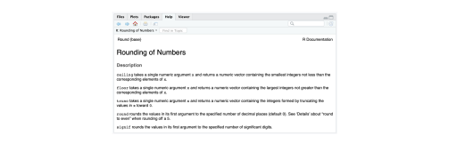
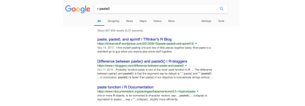
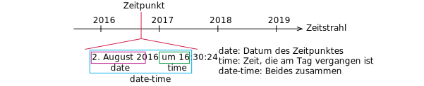
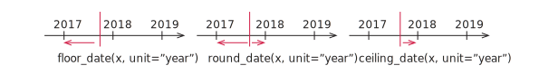

```{r setup, include=FALSE, message=FALSE}
source("style/setup.R")
```

class: newtopic

# 1. Operatoren und grundlegende Funktionen

---

# Arithmetische Operatoren

.down80[]

Operator | Beschreibung | Beispiel
:-:|:-|:-
+ | Addieren | 4 + 5 = 9
- | Subtrahieren | 5 - 4 = 1
* | Multiplizieren | 4 * 4 = 16
/ | Dividieren | 1 / 2 = 0.5
^ | Potenzieren | 2^0.5 = 1.414214
%% | Modulo bilden | 7 %% 5 = 2

---

# Beispiel

```{r}
1e5 / 33
pi %% 3
1 / 3 + 1 / 2
6^8
```

- Werte werden ohne spezielle print-Anweisung ausgegeben
- Standardmäßig werden Fließkommaoperationen durchgeführt
- Lassen Sie Platz um die Operatoren (außer um ^)

---

class: newtopic

# Aufgabe 1 (in uebung.Rmd)

---

# Variablen 1/2

```{r}
x <- 32
y <- 7 / 8
x * y
```

## Anmerkungen

- Daten und Berechnungsergebnisse werden in Variablen gespeichert
- Der Zuweisungsoperator in R ist ` <- ` (Tastenkombination alt + -)
- Variablen im *Environment* gelistet (RStudio oben rechts)
- Namen von Variablen müssen mit einem Buchstaben beginnen

---

# Variablen 2/2

```{r}
X <- pi
x <- 2
a.b <- 100
x * X * a.b
```

## Anmerkungen

- `pi` ist eine vorbelegte Variable mit Näherung für $\pi$
- Groß- und Kleinschreibung wird berücksichtigt
- Der Punkt ist ein ganz normaler Buchstabe und kein Operator

---

# Weitere Zuweisungsoperatoren

## Zuweisung nach rechts

```{r}
33 -> x
x
```

- Die Schreibweise `<-` funktioniert auch so `->` rum

--

.down40[]

## Es geht aber auch traditionell

```{r}
x = 200
x
```

- Wenn Ihnen das lieber ist, verwenden Sie `=`
- Bei einer Schreibweise bleiben

---

# Primitive Datentypen

.down40[]

Datentyp | Literale
-|-
logical | TRUE, FALSE
integer | 5L, 125L
double | 1, 1.75, 1e10
character | "Hello World!"

.down40[]

## Anmerkungen

- Datentypen werden nicht explizit angegeben (anders als in Java)
- Voreinstellung für Zahlen ist `double`
- Anderen Programmiersprachen: String statt Character

---

# Spezielle Konstanten

.down80[]

Konstante | Bedeutung
-|-
Inf und -Inf | Unendlich und minus Unendlich
NaN | Rechenoperation ergibt keine Zahl, z.B. $\sqrt{-1}$
NULL | Ein leeres Objekt
NA | Unbekannter Datenwert (Not Available)

---

# Mathematische Funktion (die üblichen)

Funktionen | Beschreibung
-|-
sin(x), cos(x), tan(x), ... | Trigonometrische Funktionen
abs(x), sqrt(x) | Absolutwert, Wurzel
log(x), exp(x) | Natürlicher Logarithmus und Exponentialfunktion
log2(x), log10(x) | Logarithmus mit anderen Basen

## Beispiele

```{r}
exp(1)
log2(4096)
```

---

# Funktionen zur Typumwandlung

.down120[]

Funktion | Bedeutung
-|-
as.numeric(x) | Konvertiert in eine Zahl
as.character(x) | Konvertiert in eine Zeichenkette
as.logical(x) | In Wahrheitswert konvertieren

---

# Beispiele

```{r}
3 * as.numeric("1.81")
as.character(pi)
as.logical(0)
as.logical(0.1)
```

---

# Vergleichsoperatoren/Wahrheitswerte

.up10[]

## Vergleichsoperatoren

<br/>
.up60[]

Operator | Bedeutung
:-:|:-:
a < b, a <= b | Kleiner und kleiner gleich
a > b, a >= b | Größer und größer gleich
a == b, a != b | Exakt gleich und nicht gleich
near(a, b) | Fast gleich
is.na(x) | Test of `x` gleich `NA`

## Verknüpfung von Wahrheitswerten

<br/>
.up60[]

Operator | Bedeutung
:-:|:-:
a && b | Logisches und
a <html>&#124;</html><html>&#124;</html> b | Logisches oder
!a | Negation

- Wie in Java und vielen anderen Programmiersprachen

---

# Beispiele

.up40[]

.pull-left[
```{r}
NA == 10
is.na(NA)
is.na(10)
pi >= 3.14
pi != 1
as.character(3 * 9 + 1) == 28
```
]
.pull-right[
```{r}
TRUE || FALSE
TRUE && FALSE
!FALSE
```
]

---

# Rechengenauigkeit

## Achtung

```{r}
sqrt(2) ^ 2 == 2
1 / 49 * 49 == 1
```
-> Rundungsfehler, der Computer rechnet mit einer endlichen Anzahl von Nachkommastellen

## Überprüfung in R

```{r}
near(sqrt(2)^2, 2)
near(1/49*49, 1)
```

---

# Weitere nützliche Funktionen

.down80[]

Funktion | Beschreibung
-|-
paste0(...) | Verbindet mehrere Werte zu Character
paste(..., sep = " ") | Wie paste0 aber mit Trennzeichen
signif(x, digits = 6) | Rundet auf Anzahl von signifikanten Stellen
round(x, digits = 0) | Runden auf Anzahl von Stellen

---

# Beispiele

```{r}
paste(1, 2, 3, 4, 5, 6)
paste(1, 2, 3, 4, 5, 6, sep = ", ")
paste0(1, 2, 3, 4, 5, 6)
signif(9283649, 4)
paste0("pi=", round(pi, digits = 4))
```

---

# Optionale Parameter von Funktionen

.font120[
```{r, eval = FALSE}
round(x, digits = 0)
```
]

Die Funktion `round` hat einen Parameter x (die Zahl die gerundet werden soll) und einen optionalen Parameter digits (Anzahl der Stellen). Wird digits nicht angegeben, dann verwendet R den Wert 0. Beim Funktionsaufruf kann man den Namen des Parameters weglassen (kürzer) oder angeben (meist besser zu verstehen). 

```{r}
round(pi)
round(pi, 1)
round(pi, digits = 2)
```

---

# Funktionen mit vielen Parametern

.font120[
```{r, eval = FALSE}
`paste(..., sep = " ")
```
]

Der Funktion `paste` können beliebig viele Parameter übergeben werden. Der Name des optionalen Parameters muss angegeben werden.

```{r}
paste(1, 2, 3)
paste(1, 2, 3, 4, 5, 6, "$")
paste(1, 2, 3, 4, 5, 6, sep = "$")
```

---

# Hilfe zu R-Funktionen



- In RStudio in den Funktionsnamen klicken und Taste F1 drücken
  * Hilfetexte in der Regel nicht ganz einfach zu lesen
  * Oft werden verwandte Funktionen gemeinsam erklärt
  * Das wird mit der Zeit besser

---

class: newtopic

# Aufgabe 2 (in uebung.Rmd)

---

# Richtig googeln



- Auf Google mit Suchanfragen der Form "r Suchphrase"
 - Problem: Häufig zu viele Antworten oder die falsche Information
- Erst denken, dann googeln, dann nochmal denken
- Nichts aus dem Internet abtippen, das Sie nicht verstehen
- Meistens ist .org besser als .com

---

class: newtopic

# 2. Datenstrukturen

---

# Datenstrukturen in R

.up60[]


Datenstruktur | Beschreibung
-|-
**Vektor** | Reihe von Elementen mit gleichem Datentyp
Matrix | Wie Vektor aber mit Zeilen und Spalten
Array | Wie Matrix aber beliebig viele Indizes
List | Wie Vektor aber verschiedene Datentypen
**Dataframe** | Liste, jedes Element ein Vektor, Spalten haben Namen

→ Dataframe = Datensatz einer Erhebung

---

class: newtopic

# 2.1 Vektoren

Für uns wichtig

- Vektoren als Eingabewerte (zum Beispiel beim Plotten)
- Rechenoperationen für Vektoren (Mittelwert etc.)

→ Hier nur die Dinge, die wir auch benötigen

---

# Erzeugen von Vektoren

.down40[]

Funktion | Beschreibung
-|-
a:b | Erzeugt ein Array von `a` bis `b` mit Inkrement 1
c(x1, x2, x3) | Erzeugt ein Array mit den Werten `x1`, `x2`, `x3`
seq(a, b, by = inc) | Erzeugt ein Array von `a` bis `b` mit Inkrement `inc`
seq(a, b, length.out = n) | Erzeugt ein Array von `a` bis `b` mit `n` Elementen
rep(x, times = n) | Hängt das Array oder die Zahl `x` `n`-mal hintereinander
rep(x, each = n) | Wiederholt jedes Element in `x` `n`-mal

.down20[]

## Anmerkungen

- `a:b` wie in Matlab (aber kein 1:0.1:2)
- c steht für *combine*

---

# Beispiele

.up30[]

```{r}
1:-6                            # Geht auch rückwärts
c("A", "B", "C", 1:3)           # Typkonvertierung automatisch
seq(1, 5, by = 0.7)             # Zweiter Wert nicht unbedingt dabei
seq(1, 5, length.out = 6)       # Inkrement automatisch
rep(c(4, 7, 1, 1), times = 3)   # Drei mal hintereinander
rep(c(4, 7, 1, 1), each = 3)    # Jedes Element drei mal
```

---

# Operatoren & Funktionen für Vektoren

```{r}
x <- 1:5
y <- 5:1
x + y
1 + x
x * y
sqrt(x)
```

--

→ Ausführung Elementweise

---

# Kuriositätenkabinett

```{r}
a <- 0:8
b <- c(1, 11)
c <- 99
```

## Damit

```{r}
a + b
a %% 2 == 0
a[a %% 3 == 0]
c[1]
```

---

# Funktionen für Vektoren

.down80[]

Funktion | Bedeutung
- | -
c(a, b) | Vektor erzeugen (geht auch mit Vektoren)
length(a) | Länge eines Vektors
sum(a), prod(a) | Summe oder Produkt der Elemente
rev(a) | Reihenfolge umdrehen
unique(a) | Unterschiedliche Elemente
a %in% b | Ist `a` in `b` enthalten?

---

# Beispiele 1/2

```{r}
a <- rep(1:3, 2)
a
```

## Operationen

```{r}
c(a, c(5, 19))
length(a)
sum(a)
rev(a)
```

---

# Beispiele 2/2

```{r}
a
unique(a)
1 %in% a
9 %in% a
```

---

class: newtopic

# Aufgabe 3 (in uebung.Rmd)

---

# Statistische Funktionen (Wiederholung)

Funktion | Beschreibung
-|-
min(x), max(x) | Kleinster und größter Wert
mean(x) | Mittelwert
var(x) | Varianz
sd(x) | Standardabweichung
cor(x, y) | Korrelationskoeffizient
quantile(x, probs = c(q1, q2, ...) | Quantilwerte
summary(x) | Gibt Fünf-Punkte-Zusammenfassung aus

## Zum Beispiel

```{r}
summary((0:100)^2)
```

---

# 2x der Korrelationskoeffizient

## Zu Fuß

```{r}
x <- 1:10
y <- x + 0.5 * x^2
n <- length(x)
xmid <- 1 / n * sum(x)
ymid <- 1 / n * sum(y)
sum((x - xmid) * (y - ymid)) / sqrt(sum((x - xmid)^2) * sum((y - ymid)^2))
```

--

## Mit R-Funktion

```{r}
cor(x, y)
```

---

# Benannte Vektoren

Die Einträge von Vektoren können benannt werden

```{r}
stundenlohn <- c("Kellner*in" = 8.5, "Ingenieur*in" = 50)
stundenlohn
stundenlohn[1]
stundenlohn["Kellner*in"]
mean(stundenlohn)
```

→ Anwendung: Zum Beispiel bei Farbskala

---

class: newtopic

# 2.2 Dataframes

---

# Dataframe erzeugen mit `tibble()`

.font90[
```{r}
d <- tibble(X=0:4, Y=c(1.2, 3.2, 0.5, 0.9, 1.1), Z=c("A", "B", "C", "D", "E"))
d
```
]

.down40[]

## Anmerkungen

- Merkmale und Werte in der Form `Name = Vektor`
- Wir lesen Dataframes in der Regel aus Dateien (Excel, CSV, etc.)
- `tibble()` stammt aus dem tidyverse von Hadley Wickham (dazu gleich mehr)

---

# Dataframe ausgeben 1.2

```{r}
d
str(d)
```

---

# Dataframe ausgeben 2/2

```{r}
summary(d)
bo_kable(d)
```

---

# Auf Spalten zugreifen

```{r}
d$X
d$Z
d$Z[4]
```

.down20[]

## Funktionsweise

- d$X liefert die Werte zum Merkmal X als Vektor
- Auf einzelne Werte kann dann mit `[idx]` zugegriffen werden
- Indizierung beginnt bei 1

---

# Beispiel: Regressionsgerade/Bestimmtheitsmaß

```{r}
xmid <- mean(d$X)
ymid <- mean(d$Y)
beta <- sum((d$X - xmid) * (d$Y - ymid)) / sum((d$X - xmid)^2)
alpha <- ymid - beta * xmid
R2 <- sum((alpha + beta * d$X - ymid)^2) / sum((d$Y - ymid)^2)
paste0("alpha = ", alpha, ", beta = ", beta, ", R2 = ", signif(R2, 5))
```

---

# Hinweis: Geht auch kürzer

```{r}
m <- lm(Y ~ X, data = d)
summary(m)
```

---

class: newtopic

# 3. Datum und Uhrzeit

---

# Warum und womit

.down60[]

## Fragen

- Hat jedes Jahr 365 Tage?
- Hat jeder Tag 24 Stunden?
- An welchem Wochentag sind Sie geboren?

--

.down20[]

→ Komplizierter als man auf den ersten Blick vielleicht denkt

--

.down60[]

## Einfach(er) mit dem lubridate-Paket

```{r}
  library(lubridate)
```

--

.down20[]

→ Zu Beginn laden

---

# Date, Time und Date-Time



```{r}
now()                # date-time
today()              # date
hms::as.hms(now())   # time
```

---

class: newtopic

# 3.1 Datum und Uhrzeit aus Zeichenketten

---

# *Date* mit `ymd` und Varianten

.pull-left[
```{r}
ymd("2016-11-30")
dmy("30 8 2012")
mdy("8/1/1998")
dmy(30052015)
```
]

.pull-right[
**Anmerkungen**
- Liest Datum aus Zeichenkette (Trennzeichen fast beliebig) oder Zahl
- Wenn Zahl: Mit 0X angeben, falls X < 10
- `ymd`, `dmy` oder `mdy` je nach Reihenfolge
- In Deutschland meistens Tag/Monat/Jahr
- Tipp beim Ausprobieren: Tag > 12 verwenden um Fehler zu finden
- Ausgabe in Schreibweise JJJJ-MM-TT
]

---

# *Date-time* mit `ymd_hms` und Varianten

```{r}
ymd_hms("2016-11-30 10:30:10", tz = "Europe/Berlin")
dmy_hm("30 8 2012 12:59", tz = "Europe/Berlin")
mdy_h(0226201304, tz = "Europe/Berlin")
```

## Anmerkungen

- Liest Datum und Uhrzeit aus Zeichenkette (Trennzeichen fast beliebig) oder Zahl
- Wenn Zahl: Mit 0X angeben, falls X < 10
- Wieder je nach Reihenfolge
- Zeitzone mit angeben (Voreinstellung ist UTC)

---

# *Time* mit `hms::as.hms` und Varianten

```{r}
hms::as.hms(85)
hms::as.hms(dmy_hms("1:6:1987 13:17:01", tz = "Europe/Berlin"))
hms::hms(hours = 1, minutes = 23, seconds = 15)
```

## Anmerkungen
- Zeit, die seit 0 Uhr verstrichen ist
- Funktion `hms()` aus lubridate-Paket funktioniert nicht beim Plotten
- Daher `hms::hms()` aus dem Paket hms

---

class: newtopic

# Aufgabe 4 (in uebung.Rmd)

---

class: newtopic

# 3.2 Datum und Uhrzeit aus Zahlen

---

# `make_date()` und `make_datetime()`

.down60[]

.font90[
```{r}
make_date(year = 2000, month = 10, day = 10)
make_datetime(year = 2000, month = 10, day = 10, hour = 10, tz = "Europe/Berlin")
make_datetime(year = 2000, month = 10, day = 10, hour = 10, tz = "Europe/Berlin")
```
]

.down40[]

## Anmerkungen
- Parameter sind optional

---

class: newtopic

# 3.3 Datumskomponenten

---

# Jahr und Monat

.font90[
```{r}
(d <- dmy_hms("1.11.2010 12:22:01")) # Zuweisung in Klammern: Wert wird ausgegeben
year(d)
month(d)
month(d, label = TRUE)
```
]

## Anmerkungen

- Namen des Monats mit `label = TRUE`
- Levels: Richtige Sortierung (nicht alphabetisch)

---

# Tag

.font90[
```{r}
day(d)
yday(d)
wday(d)
wday(d, label = TRUE)
```
]

## Anmerkungen

- Namen des Tages mit `label = TRUE`
- Hängt von Ländereinstellung des Computers ab

---

class: newtopic

# Aufgabe 5 (in uebung.Rmd)

---

class: newtopic

# 3.4 Rechnen mit Datum und Zeit

---

# Zeitdifferenzen 1/2

.up10[]

## Alter von Angela Merkal in Tagen (`r today()`)

```{r}
today() - dmy("17.7.1954")
```

## Zeit zwischen zwei Anweisungen

```{r}
d1 <- hms::as.hms(now())
d2 <- hms::as.hms(now())
d2 - d1
```

---

# Zeitdifferenzen 2/2

.up10[]

## Ende März um halb drei

```{r}
(d <- dmy_hm("30.3.2019 14:30", tz = "Europe/Berlin"))
```

--

.up10[]

## 23 Stunden später

```{r}
d + dhours(23)
```

--

.up10[]

- Umstellung auf Sommerzeit
- `dhours()`: Zeitdauer in physikalischen Stunden

--

.up10[]

## Auch 23 Stunden später

```{r}
d + hours(23)
```

--

.up10[]

- `hours()`: Zeitdauer in Stunden auf der Uhr

---

# 'Normal' rechnen mit Datum/Zeit

## In Zahl konvertieren mit `as.numeric()`

```{r}
as.numeric(ymd_hms("1970-1-1 0:0:11", tz = "UTC"))
as.numeric(ymd("1970-1-12"))
as.numeric(hms::as.hms(ymd_hms("1988-11-11 0:0:11", tz="Europe/Berlin")))
```

## Welche Zahlen kommen dabei heraus?

- Date-time: Sekunden seit Beginn des Jahres 1970 (in UTC)
- Date: Tage seit Beginn des Jahres 1970
- Time: Sekunden seit Beginn des Tages

---

# 'Normal' rechnen mit Zeitdifferenzen

```{r}
d1 <- hms::as.hms(now())
d2 <- hms::as.hms(now())
d2 - d1
```

- Das Ergebnis ist vom Typ 'Time Difference' und keine Zahl

```{r}
1000 * as.numeric(d2 - d1)
```

- Mit `as.numeric()` in Zahl konvertieren
- Ausgabe jetzt in Millisekunden

---

class: newtopic

# 3.5 Datum runden

---

# Datum runden

.up20[]



.up20[]

```{r}
floor_date(d, unit = "hour")
ceiling_date(d, unit = "5 minutes")
```

.up10[]

## Anmerkungen
- `floor_date()` : Abrunden
- `round_date()` : Runden
- `ceil_date()` : Aufrunden
- Einheit, zu der gerundet werden soll, mit `unit = XXX` angeben
- Man kann auch zu einem Vielfachen einer Einheit runden

---

# Ganz zum Schluss

Mit `sprintf` können Ausgaben ein bisschen schicker gestaltet werden. Dabei steht `%i` für eine ganze Zahl und `%5.3f` eine Fließkommazahl insgesamt fünf Zeichen breit mit 3 Nachkommastellen.

```{r}
x <- 1 / 3

sprintf("%i Hallo! x = %5.3f", 45, x)
```

Den Wert von Variablen kann man auch in den Text einbauen. Hier ein Beispiel 

$$1 / 3 \approx `r x`$$  

mit einer Variablen in einer Formel. Mehr zu diesem Thema hier:

  https://rmarkdown.rstudio.com/lesson-4.html


---

# Das waren die Basics von R 

.down60[]

## Auswahl der Themen

- Sehr stark eingeschränkt
- Nur das absolut Notwendige (subjektive Auswahl)

.down40[]

## Was haben wir ausgelassen?

- Kontrollstrukturen: Schleifen und Verzweigungen
  * Für unsere Zwecke nicht notwendig
  * Es gibt elegantere Alternativen
- Eigene Funktionen erstellen
  * Wir schaffen das (erstmal ohne)
