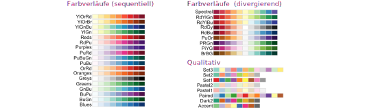

```{r setup, include=FALSE, message=FALSE}
source("style/setup.R")
load("data/data-lecture.Rdata")
```

class: newtopic

# 1. Weitere Geoms

---

class: newtopic

# 1.1 Linienplots mit geom_line()

---

# Minimalbeispiel `geom_line()`

```{r, fig.height=3}
d <- data.frame(A = c(1, 2, 3, 4), B = c(2, 6, 4, 4.5))
ggplot(data = d) + geom_line(mapping = aes(x = A, y = B))
```

- `data.frame()`: Dataframe mit Merkmalen A und B
- `geom_line()` funktioniert im Prinzip genau wie `geom_point()`

---

# BIP Länder (erster Versuch) 

```{r, warning=FALSE}
ggplot(data = d_wb_countries) + 
  geom_line(mapping = aes(x = year, y = gdp))
```

.up40[]

## Problem 

- Nicht klar, dass nur Punkte derselben Länder verbunden werden sollen!

---

# BIP Länder (zweiter Versuch) 

```{r, warning=FALSE}
ggplot(data = d_wb_countries) + 
  geom_line(mapping = aes(x = year, y = gdp, group = country))
```

.up40[]

## Lösung

- Mit `group = <M>` wird angegeben, welche Punkte zusammen gehören

---

# BIP Länder (Farbe)

```{r, warning=FALSE}
ggplot(data = d_wb_countries) + 
  geom_line(mapping = aes(x = year, y = gdp, color = country, group = country))
```

.up40[]

## Geht auch mit der Farbe

- Mit `color = c` werden (meistens) gleichfarbige Linien verbunden
- Manchmal muss man zusätzlich noch `group = <Merkmal>` angeben (schadet nicht)

---

# BIP Länder: Farbe und Population 

```{r, fig.height = 3}
ggplot(data = d_wb_countries) + geom_line(
    mapping = aes(x = year, y = gdp, color = country, size = pop), 
    lineend = "round")
```

- `size = s` legt Linienstärke fest
- `lineend = "round"` als Argument damit es gut aussieht

---

class: newtopic

# 1.2 Und sonst noch...

---

# Liniensegmente mit `geom_segment()`

```{r, fig.height = 3}
ggplot(data = d_wb_countries_2012) +
  geom_segment(mapping = aes(x = 0, xend = pop, y = country, yend = country), size = 1) +
  geom_point(mapping = aes(x = pop, y = country), size = 4)
```

- Notwendige AES: x, y, xend, yend
- AES können auch feste Werte sein

---

# Rechtecke mit `geom_tile()`

```{r}
d <- data.frame(X = c(0,1,3), Y = c(3,2,1), W = c(1,0.5,1), H = c(2,3,1))
ggplot(data = d) +
  geom_tile(mapping = aes(x = X, y = Y, width = W, height = H)) +
  geom_point(mapping = aes(x = X, y = Y), color = "red")
```

.up20[]

- Notwendige AES: Mittelpunkt und Breite/Höhe

---

# Rechtecke mit `geom_rect()`

```{r}
d <- data.frame(X1=c(0,1.5,3), Y1=c(2.5,2,1), X2=c(1,2.5,3.5), Y2=c(1,3,2))
ggplot(data = d) +
  geom_rect(mapping = aes(xmin = X1, ymin = Y1, xmax = X2, ymax = Y2)) +
  geom_point(mapping = aes(x = X1, y = Y1), color = "red") + geom_point(mapping = aes(x = X2, y = Y2), color = "blue")
```

.up20[]

- Notwendige AES: Koordinaten der Eckpunkte

---

class: newtopic

# 2. Plots aufbereiten

---

class: newtopic

# 2.1 Facetten mit `facet_wrap`

---

# Boxplots der täglichen Niederschläge 

```{r, fig.height=3}
ggplot(data = filter(d_ns_bochum_tag, Jahr %in% 2014:2017)) +
  geom_boxplot(mapping = aes(x = Monat, y = NS)) +
  facet_wrap(~Jahr, ncol = 2)                                   #<<
```

- `facet_wrap(~Merkmal)`: Für jede Ausprägung des Merkmals ein Plot
- Anzahl der Zeilen oder Spalten mit `ncol =  nc` oder `nrow = nr`
- Jahre 2014 - 2017 mit `filter()` (später)

---

class: newtopic

# 2.2 Skalen

---

# Was sind Skalen?

.pull-left[
  
]

.pull-right[
  Skalen regeln die Abbildung von Daten auf die Eigenschaften geometrischer Objekte (AES).
]

<br/>
.up20[]

##  Form der Angaben zu Skalen: `scale_XXX_YYY(<Arguments>)`

<br/>
.up40[]

XXX | YYY | Funktion
-|-
x,y | continuous, discrete | Koordinatenachsen konfigurieren
x,y | reverse, sqrt, log10 | Koordinatenachsen transformieren
color, fill | grey, hue, manual, brewer, ... | Farbe und Füllfarbe ändern

Darüber hinaus gibt es Skalen für alle anderen visuellen Eigenschaften (Transparenz, Linientyp, Shape, ...). In der Regel muss man diese aber nicht anpassen.

---

# Skalen werden automatisch eingefügt

Werden keine Skalen angegeben (so wie bisher), dann fügt ggplot automatisch die richtigen Skalen ein. Aus 

```{r, eval = FALSE}
ggplot(data = d_wb_all) + geom_point(mapping = aes(x = year, y = gdp))
```

wird dadurch

```{r, eval = FALSE}
ggplot(data = d_wb_all) + geom_point(mapping = aes(x = year, y = gdp)) +
  scale_x_continuous() + scale_y_continuous()                               #<<
```

Sollen die Skalen geändert werden, dann müssen die entsprechenden Objekte von Hand erzeugt werden.

---

class: newtopic

# 2.2.1 Achsen kontinuierlich

---

# Achspunkte ändern

```{r}
ggplot(data = d_wb_all) + geom_point(mapping = aes(x = year, y = gdp)) +
  scale_x_continuous(breaks = c(1965, 1990, 2015)) #<<
```

.up20[]

- Änderung der Beschriftung mit `breaks = b`
- `c(...)` erzeugt einen Vektor (später)

---

# Argumente (kontinuierliche Achsen)

.down40[]

Argument | Beschreibung
-|-
breaks | Vektor mit Werten für Achspunkte
minor_breaks | Vektor mit Werten für zwischen-Achspunkte
limits | Vektor mit zwei Elementen für Begrenzung
labels | Vektor mit Beschriftung (selten)

.down40[]

## Anmerkungen

- Keine Punkte mit `breaks = NULL` bzw. `minor_breaks = NULL`
- Durch `limits` werden die entsprechenden Daten vor dem Plotten entfernt (manchmal nicht erwünscht). Alternativ die Plotgrenzen bei `coord_cartesian()` angeben (gleich)

---

class: newtopic

# 2.2.2 Achsen diskret

---

# Beschriftung ändern

```{r}
ggplot(data = d_wb_2012) + geom_bar(mapping = aes(x = region)) +
  scale_x_discrete(labels = c("A", "B", "C", "D", "E", "F", "G"))
```

.up10[]

- Änderung der Beschriftung mit `labels = l`
- Keine weiteren Möglichkeiten (für uns)

---

class: newtopic

# 2.2.3 Achsen anpassen

---

# Große Skalenunterschiede

```{r, fig.height = 3}
ggplot(data = d_wb_2012) +
  geom_point(mapping = aes(x = gdp, y = gge, fill = region, size = pop), shape = 21)

```

Problem: Fast alle Werte liegen sehr nahe bei Null

---

# Große Skalenunterschiede: Log

```{r, fig.height = 3}
ggplot(data = d_wb_2012) +
  geom_point(mapping = aes(x = gdp, y = gge, fill = region, size = pop), shape = 21) +
  scale_x_log10() + scale_y_log10() #<<
```

- Logarithmische Skala 'zoomt' in den Bereich der kleinen Werte hinein
- Nur möglichen, wenn alle Werte größer als Null sind (klar!)

---

# Möglichkeiten zur Änderung von Skalen

.down60[]

Element | Wirkung
-|-
scale_x_sqrt(), scale_y_sqrt() | Wurzelskala
scale_x_log10(), scale_y_log10() | Logarithmische Skala
scale_x_reverse(), scale_y_reverse() | Umgedrehte Skala

.down40[]

→ Definitionsbereich von $\log_{10}$ und $\sqrt{\quad}$ beachten!

---

class: newtopic

# 2.3 Farbskalen

---

class: newtopic

# Kontinuierliche Farbskala

.down40[]

Datensatz: Sinuskurve
```{r}
d <- data.frame(X = seq(0, 2, by=0.05), Y = sin(pi*seq(0, 2, by=0.05)))
```


---

# Beispiel (nicht empfohlen)

```{r}
ggplot(data = d) + geom_col(mapping = aes(x = X, y = Y, fill = Y)) +
  scale_fill_gradient(low = "green", high = "red")
```

- `scale_fill_gradient()` erzeugt Farbverlauf mit zwei Farben

---

# Beispiel (auch nicht empfohlen)

```{r}
ggplot(data = d) + geom_col(mapping = aes(x = X, y = Y, fill = Y)) +
  scale_fill_gradient2(low = "orange", mid = "yellow", high = "green")
```

- `scale_fill_gradient2()` erzeugt Farbverlauf mit drei Farben

---

# Brewer-Farbpalette (empfohlen)

```{r}
ggplot(data = d) + geom_col(mapping = aes(x = X, y = Y, fill = Y)) +
  scale_fill_distiller(palette = "RdBu")
```

- Farbpalette von Cynthia Brewer (gleich mehr dazu)

---

# Farbskala umgekehrt

```{r}
ggplot(data = d) + geom_col(mapping = aes(x = X, y = Y, fill = Y)) +
  scale_fill_distiller(palette = "RdBu", direction = 1) #<<
```

- `direction = 1` zeigt die Skala so an, wie sie definiert ist, Voreinstellung ist umgedreht

---

# Mit diskreten Farbwerten

```{r}
ggplot(data = d) + geom_col(mapping = aes(x = X, y = Y, fill = Y)) +
  scale_fill_distiller(palette = "RdBu", guide = "legend") #<<
```

- `guide = legend` zeigt diskrete Farbwerte in Legende an

---

# Mit logarithmischer Skala

```{r}
ggplot(data=mutate(d,Y=Y^16+1e-9))+geom_col(mapping=aes(x=X, y=Y, fill=Y))+
  scale_y_log10() + scale_fill_distiller(palette = "RdBu", trans = "log10") #<<
```

- Viele Werte sehr klein wegen Y^16. Daher: Logarithmische Skalen
- Farben mit `trans = "log10"` dem Logarithmus der Werte zuordnen

---

# Kontinuierliche Farbskalen

## Definierte Farbskalen

<br/>
.up40[]

Element | Argumente | Funktion
-|-
scale_XXX_gradient | low, high | Farbverlauf von low nach high
scale_XXX_gradient2 | low, mid, high | Farbverlauf mit drei Farben
scale_XXX_distiller | palette | Brewer-Farbpaletten

→ Für XXX je nach Anwendung entweder 'color' oder 'fill' einsetzen

## Optionen für alle kontinuierlichen Farbskalen

<br/>
.up40[]

Option | Mögliche Werte | Funktion
-|-|-
direction | 1, **-1** | Farbskala umkehren
guide | **"colourbar"**, "legend" | Kontinuierliche Skala oder diskrete Farben
trans | **"idendity"**, "log10", ... | Transformation für Werte

---

class: newtopic

# Diskrete Farbskala

---

# Manuelle Farben (erster Versuch)

```{r}
d <- data.frame(farbe = c("rot", "gruen", "blau", "gruen", "rot", "gruen"))
ggplot(data = d) + geom_bar(mapping = aes(x = farbe, fill = farbe)) +
  scale_fill_manual(values = c("red", "blue", "green")) #<<
```

Problem: Zuordnung von Wert zu Farbe fehlt

---

# Manuelle Farben (zweiter Versuch)

```{r}
d <- data.frame(farbe = c("rot", "gruen", "blau", "gruen", "rot", "gruen"))
ggplot(data = d) + geom_bar(mapping = aes(x = farbe, fill = farbe)) +
  scale_fill_manual(values=c("rot"="red", "blau"="blue", "gruen"="green")) #<<
```

→ Zuordnung mit  _Named Vector_ explizit angeben

---

# Brewer-Farbpalette

```{r}
ggplot(data = d_wb_2012) + geom_bar(mapping = aes(x=region, fill=region)) +
  scale_fill_brewer(palette = "Set1") #<<
```

---

# Brewer-Farbpaletten



## Kontinuierlich

`scale_color_distiller(palette = p)` oder `scale_fill_distiller(palette = p)`

## Diskret

`scale_color_brewer(palette = p)` oder `scale_fill_brewer(palette = p)`

---

# Brewer-Farbpaletten


.down40[]

- Entwickelt von Cynthia Brewer
- Kartographin an der Penn State Universität
- http://colorbrewer2.org

---

class: newtopic

# 2.4 Beschriftung

---

# Beschriftung mit labs() 

```{r, fig.height=3, message = FALSE}
ggplot(data = d_ns_bochum_monat) + 
  geom_histogram(mapping = aes(x = NS, binwidth = 15, boundary = 0)) +
  labs(                                               
    title = "Histogramm Niederschlag in Bochum", subtitle = "1951 - 2017",  #<<
    x = "Monatlicher Niederschlag (mm)", y = "Anzahl der Monate", #<<
    caption = "Quelle: Deutscher Wetterdienst" #<<
  )
```

---

# Beschriftung der Farblegende

```{r}
ggplot(data = d_wb_2012) + geom_bar(mapping = aes(x=region, fill=region)) +
  labs(fill = "Region der Welt") #<<
```

- Die Legende für eine visuelle Eigenschaft wird ebenfalls mit `labs` beschriftet
- Zum Beispiel für die Füllfarbe: `fill = Titel`

---

# Beschriftung entfernen

```{r, fig.height = 3}
ggplot(data = filter(d_ns_bochum_monat, Jahr >= 2000)) +
  geom_boxplot(mapping = aes(x = factor(Jahr), y = NS)) +
  labs(x = NULL)
```

- Wert `NULL` entfernt die Beschriftung und den dafür reservierten Platz

---

class: newtopic

# 2.5. Koordinatensysteme

---

# Achsen vertauschen mit `coord_flip()`

```{r, fig.width=8, out.width="90%"}
ggplot(data = d_wb_2012) + geom_bar(mapping = aes(x=region, fill=region)) +
  coord_flip() #<<
```

- Vertauscht die x-Achse mit der y-Achse

---

# Plotbereich mit `coord_cartesian()`

```{r, fig.height=3}
ggplot(data = d_wb_countries) + 
  geom_ribbon(mapping = aes(x=year, ymin=0, ymax=gdp, color=country, fill=country), alpha = 1/3) +
  coord_cartesian(xlim = c(1980, 2010), ylim = c(0, 4e12)) #<<
```

- Mit `xlim = c(xmin, xmax)` und `ylim = c(ymin, ymax)` in Bereich zoomen

---

# Polarkoordinaten mit `coord_polar()`

```{r, fig.height = 3}
ggplot(data = d_wb_countries) + 
  geom_ribbon(mapping = aes(x=year, ymin=0, ymax=gdp, color=country, fill=country), alpha = 1/3) +
  coord_polar(theta = "y") #<<
```

- Ein Wert wird zum Radius, der andere zum Winkel
- `theta` gibt an, welche Variable (`"x"` oder `"y"`) für den Winkel verwendet werden soll

---

# Tortendiagramm (Wiederholung)

```{r, fig.height = 3}
ggplot(data = d_wb_countries_2012) +
  geom_col(mapping = aes(x = 0, y = gge, fill = country), color = "black", width = 1) +
  coord_polar(theta = "y") + theme_void()
```

- Gestapeltes Balkendiagramm wird zum Tortendiagramm
- `theme_void()` entfernt Dekoration (gleich)

---

# Ringdiagramm (Wiederholung)

```{r, fig.height = 3}
ggplot(data = d_wb_countries_2012) +
  geom_col(mapping=aes(x = 0.5, y = gge, fill = country), color = "black", width = 1) +
  scale_x_continuous(limits = c(-1, 1)) + coord_polar(theta = "y") + theme_void() #<< 
```

- Bereich der x-Achse anpassen

---

class: newtopic

# 2.5. Feinschliff

---

class: newtopic

# 2.5.1 Themes

---

# Erscheinungsbild anpassen mit `theme()`

```{r, fig.height = 2.5}
  ggplot(data = d_wb_2012) + geom_bar(mapping = aes(x=region, fill=region)) +
    theme(
      panel.background = element_rect(fill = "pink"), 
      panel.grid.major = element_line(color = "hot pink")
    )
```
  
  - Alle Plot-Elemente lassen sich mithilfe von `theme()` anpassen
  - Insgesamt ca. 80 Einstellungsmöglichkeiten
  - Tipp: Nicht zuviel Zeit damit verbringen
  
---

# Voreingestellte Themes


.pull-left[
  
]

.pull-right[
- Vernünftige Voreinstellungen
- `theme_void()` entfernt alles
- Weitere Themes im Paket `ggthemes`
  
Globale Einstellungen zu Beginn des Dokuments. Beispiel:

```{r eval = FALSE}
  theme_set(theme_bw())
```
]

---

class: newtopic

# 2.5.2 Text

---

# Text drehen

```{r}
  ggplot(data = d_wb_2012) + geom_bar(mapping = aes(x=region, fill=region)) +
    guides(x = guide_axis(angle = 45)) #<<
```

.down20[]

- Erste Möglichkeit, wenn Beschriftungen auf x-Achse zu lang
- Geschmackssache

---

# Text versetzen

```{r}
  ggplot(data = d_wb_2012) + geom_bar(mapping = aes(x=region, fill=region)) +
    guides(x = guide_axis(n.dodge = 3)) #<<
```

.down20[]

- Zweite Möglichkeit, wenn Beschriftungen auf x-Achse zu lang

---

class: newtopic

# 2.6 Farben ändern

## Nicht jedem gefallen die grauen Balken

---

# Farben für einzelnen Plot setzen

```{r, message = FALSE}
ggplot(data = d_ns_bochum_monat) + 
  geom_histogram(mapping = aes(x = NS), fill = "orange", color = "black") #<<
```

Problem: Viel Arbeit, wenn die Plots einheitlich aussehen sollen

---

# Voreinstellungen global ändern

```{r, eval = FALSE}
line_color <- "black"
fill_color <- "light blue"
update_geom_defaults("bar",   list(fill = fill_color, color = line_color))
update_geom_defaults("point", list(fill = fill_color, color = line_color))
update_geom_defaults("boxplot", list(fill = fill_color))

# und so weiter
```

- Einstellungen für alle Plots zu Beginn des Dokuments
- Lässt sich später einfach ändern

---

# Farben angeben

## Mit dem Namen einer Farbe

- Zum Beispiel `"red"`
- `colors()` gibt Namen der vordefinierten Farben
- http://sape.inf.usi.ch/quick-reference/ggplot2/colour

## Mit Hex-Wert

- Zum Beispiel `"#45e32f"`
- Farben in R standardmäßig als Hexadezimalzahl
- Aus Zeichenprogramm

## Mit RGB-Wert

- Zum Beispiel `rgb(0, 0.7, 1)`
- Berechnet den Hex-Wert zu den RGB Komponenten

---

class: newtopic

# 2.7 Legenden entfernen

---

# Methode 1: Legende für einzelne Skala

```{r, fig.height = 3}
ggplot(data = d_wb_2012) +
  geom_point(mapping = aes(x=gdp, y=gge, color=region, size=pop)) +
  scale_x_log10() + scale_y_log10() +
  scale_size(guide = FALSE) #<<
```

- Argument `guide = FALSE` für die Skala
- Farbskala entfernen mit `scale_color_discrete(guide = FALSE)`

---

# Methode 2: Alle Legenden für ein Geom

```{r, fig.height = 3}
ggplot(data = d_wb_2012) +
  geom_point(mapping=aes(x=gdp, y=gge, color=region, size=pop), 
    show.legend = FALSE) + #<<
  scale_x_log10() + scale_y_log10()
```

- Argument `show.legend = FALSE` entfernt alle Legenden für ein Geom

---

class: newtopic

# 3. Zusammenfassung Geoms

---

# `geom_line()`: AES

.down40[]

Eigenschaft | Beschreibung | Optional
-|-|-
x | Merkmal für x-Koordinate | Nein
y | Merkmal für y-Koordinate | Nein
alpha | Transparenz | Ja
color | Linienfarbe | Ja
group | Gibt an, welche Linien zusammengehören | Ja
size | Linienstärke | Ja

.down40[]

## Tipp
- Bei `size` am besten `lineend = "round"` als Argument mit angeben

- Merkmal für y-Koordinate
- Ein einziger Boxplot ohne Angabe für x-Koordinate

