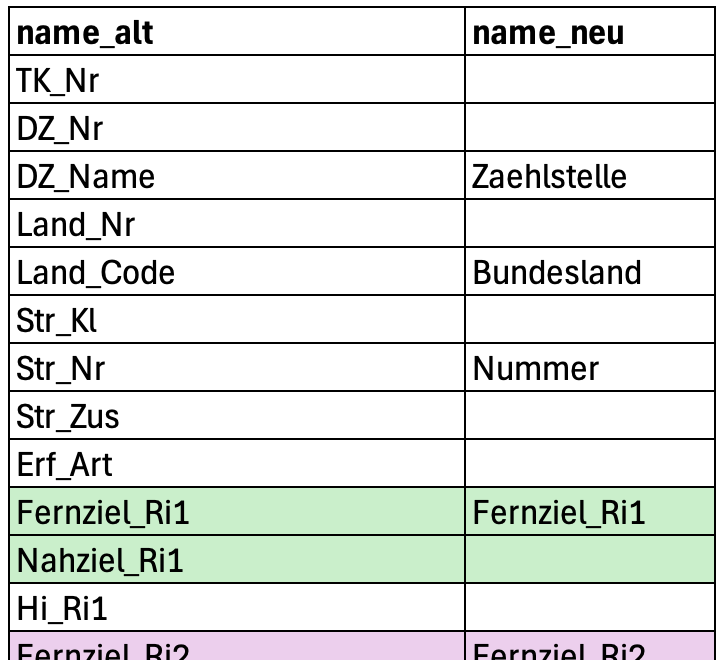

```{r}
#| echo: false
library(gt)
library(knitr)
library(readxl)
library(tidyverse)

show_dataframe <- function(d, options, ...) {
  gt(d) |>
    opt_interactive(
      use_text_wrapping = FALSE,
      page_size_default = 9,
      use_compact_mode = TRUE,
      use_pagination = (nrow(d) > 9)
    ) |>
    knitr::knit_print(options, ...)
}
registerS3method("knit_print", "data.frame", show_dataframe)
```

# Dataframes speichern und laden

## Dataframe speichern und laden 1/3

Manchmal dauert es lange einen bestimmten Dataframe zu erzeugen. Dies kann zum Beispiel der Fall sein, wenn die Daten zuerst aus dem Internet heruntergeladen werden müssen. Dann macht es oft Sinn, das Projekt in zwei Dateien aufzuteilen:

1. In der einen qmd-Datei werden die Daten geladen und aufbereitet. Die fertigen Daten können dann auf der Festplatte abgelegt werden.

2. In einer anderen qmd-Datei werden die aufbereiteten Daten von der Festplatte eingelesen und dann statistisch ausgewertet.

Diese Vorgehensweise lässt sich mit wenig Aufwand durch die Funktionen `save` und `load` realisieren.

## Dataframe speichern und laden 2/3

```{r}
d <- tibble(A = c(1, 2, 3), B = c("u", "v", "w"))
save(d, file = "daten/test.RData")
rm(list = "d")
```

Dataframe `d`

1.  anlegen
1.  in der Datei `daten/test.RData` speichern
1.  löschen (nur für Demonstrationszwecke)

## Dataframe speichern und laden 3/3

```{r}
load("daten/test.RData")
d
```

-   Dataframe `d` wurde aus der Datei geladen und ist jetzt wieder vorhanden
-   Einlesen geht auch für umfangreiche Datensätze sehr schnell

# Zeichenketten suchen und ersetzen

## Beispieldatensatz

```{r}
d <- tibble(
  Name = c("unistrasse_nord", "unistrasse_sued", "markstrasse_ost", "markstrasse_west"),
  Wert = c(10, 20, 4, 8)
)
d
```

## Richtung löschen

```{r}
d |>
  mutate(NameKurz = str_replace(Name, "_nord|_sued|_ost|_west", ""))
```

- Mit `str_replace` Richtungen durch eine leere Zeichenkette ersetzen
- Verschiedene zu ersetztende Zeichenketten mit `|` trennen

# Daten mit sehr vielen Merkmalen und/oder kryptischen und/oder langen Namen für Spalten

🎥 [Erklärvideo](https://youtu.be/ErfhSCqGEAI)

## Beispieldatensatz

```{r}
d <- read_csv2("daten/Jawe2020.csv", locale = locale(encoding = "ISO-8859-1"))
d
```

-   Daten zu Dauerzählstellen von der Bast
-   Tabelle mit `{r} ncol(d)` Spalten
-   Idee: Auswahl und Benennung der Spalten in Excel-Tabelle

## Schritt 1: Tabelle anlegen und in Excel bearbeiten

```{r}
colnames(d) |>
  as_tibble_col(column_name = "name_alt") |>
  write_csv("daten/jawe-spalten.csv")
```

::::: columns
::: {.column width="40%"}

:::

::: {.column width="60%"}
[]{.down20}

- `jawe-spalten.csv` in Excel öffnen
- Spalten benennen
- Als Excel-Dokument speichern
:::
:::::

## Schritt 2: Namen einlesen und umbenennen

```{r}
colnames <- read_excel("daten/jawe-spalten.xlsx") |>
  filter(!is.na(name_neu)) |>
  select(name_neu, name_alt) |>
  deframe()
d1 <- d |> select(all_of(colnames))
```

::::: columns
::: {.column width="53%"}
```{r}
#| echo: false
d1
```
:::

::: {.column width="47%"}
- Namen der Spalten
  - Tabelle einlesen
  - Zeilen mit neuem Namen
  - Spalten anordnen
  - Mit `deframe` in *named vector* konvertieren
- Dataframe
  - Spalten aus `colnames`
:::
:::::

# Namen von Spalten enthalten Merkmale und Werte

🎥 [Erklärvideo](https://youtu.be/QLcFr6oLxK8)

## Beispieldatensatz

```{r}
d_f <- read_excel("daten/familien-1.xlsx")
d_f
```

-   Unhandlich
-   Ziel: Tabelle mit einer Zeile je Kind

## Schritt 1: Alles in eine Zeile

```{r}
d1 <- d_f |>
  pivot_longer(
    cols = starts_with("kind"), values_transform = as.character, values_drop_na = TRUE
  )
```

::::: columns
::: {.column width="30%"}
```{r}
#| echo: false
d1
```
:::

::: {.column width="70%"}
-   Alle Spalten, die mit "kind" anfangen auswählen
-   Name der Spalte wird Merkmal 'name'
-   Wert wird Merkmal 'value'
-   Einträge in Zeichenketten konvertieren
    -   nur falls unterschiedliche Werte
-   Zeilen ohne Werte wegwerfen
:::
:::::

## Schritt 2: Spalten für Kind und Merkmal

```{r}
d2 <- d1 |>
  separate(name, into = c(NA, "kind", "merkmal"))
```

```{r}
#| echo: false
d2
```

- Inhalt von Variable `name` in Variablen `kind` und `merkmal` aufteilen
- Nicht benögte Spalte mit `NA`

## Schritt 3: Spalten für Merkmale

```{r}
d3 <- d2 |>
  pivot_wider(names_from = merkmal, values_from = value) |>
  mutate(alter = as.integer(alter))
```

```{r}
#| echo: false
d3
```

-   Aus Inhalt der Spalte `Merkmal` werden Namen von Spalten
-   Werte aus Spalte `value` einsetzen
-   `Alter` wieder in Zahl umwandeln (optional)

## In einem Rutsch

```{r}
d_k <- d_f |>
  pivot_longer(
    cols = starts_with("kind"), values_transform = as.character, values_drop_na = TRUE
  ) |>
  separate(name, into = c(NA, "kind", "merkmal")) |>
  pivot_wider(names_from = merkmal, values_from = value) |>
  mutate(Alter = as.integer(alter))
```

## In einem Rutsch

```{r}
d_k
```

# Namen von Spalten enthalten Merkmale und es gibt Defaultwerte

🎥 [Erklärvideo](https://youtu.be/TdqZLldXfjc)

## Beispieldatensatz

```{r}
d_f <- read_excel("daten/familien-2.xlsx")
```

```{r}
#| echo: false
d_f
```

-   Unhandlich
-   Ziel: Tabelle mit einer Zeile je Kind
-   Werte aus Spalte `Schule alle Kinder` übernehmen

## Schritt 1: Alles in eine Zeile

```{r}
d1 <- d_f |>
  pivot_longer(cols = starts_with("kind"), values_to = "schule")
```

::::: columns
::: {.column width="65%"}
```{r}
#| echo: false
d1
```
:::

::: {.column width="35%"}
- Alle Variablen mit `"kind"`
:::
:::::

## Schritt 2: Spalte für Kind

```{r}
d2 <- d1 |>
  separate(name, into = c(NA, "kind", NA)) |> mutate(kind = as.integer(kind))
```

::::: columns
::: {.column width="65%"}
```{r}
#| echo: false
d2
```
:::

::: {.column width="35%"}
-   Von den neuen Spalten nur `kind` behalten
-   In Zahl umwandeln
:::
:::::

## Schritt 3: Defaultwert raussuchen

```{r}
d3 <- d2 |>
  mutate(
    schule = if_else(is.na(schule) & kind <= anzahl_kinder, schule_alle_kinder, schule)
  ) |>
  filter(!is.na(schule)) |>
  select(-schule_alle_kinder, -anzahl_kinder)
```

::::: columns
::: {.column width="50%"}
```{r}
#| echo: false
d3
```
:::

::: {.column width="50%"}
-   Defaultwert übernehmen, falls
    -   kein Wert für Schule
    -   Nummer des Kindes kleiner gleich Anzahl Kinder
-   Ansonsten alten Wert beibehalten
-   Zeilen ohne Schule löschen
:::
:::::

## In einem Rutsch

```{r}
d_k <- d_f |>
  pivot_longer(cols = starts_with("kind"), values_to = "schule") |>
  separate(name, into = c(NA, "kind", NA)) |>
  mutate(Kind = as.integer(kind)) |>
  mutate(
    schule = if_else(
      is.na(schule) & kind <= anzahl_kinder, schule_alle_kinder, schule
    )
  ) |>
  filter(!is.na(schule)) |>
  select(-schule_alle_kinder, -anzahl_kinder)
```

## In einem Rutsch

```{r}
d_k
```
